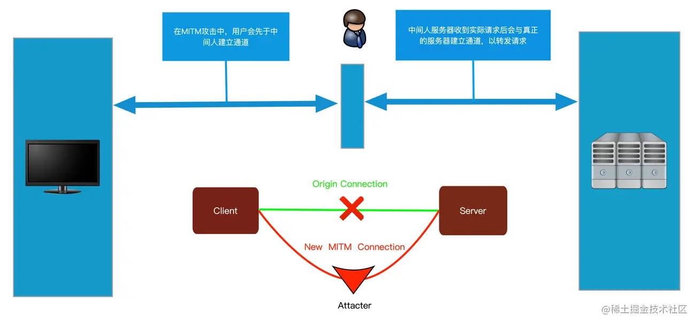
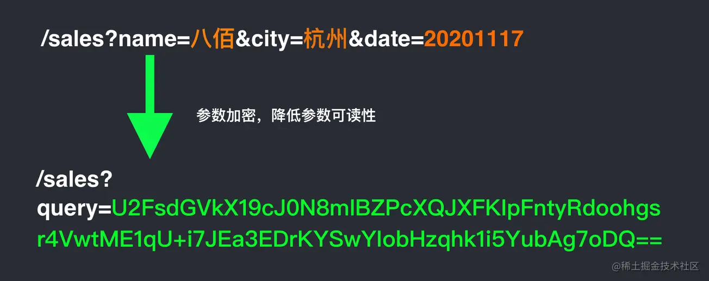

## 1、XSS 攻击

攻击方式：

- 攻击者访问前端页面，在输入框中输入编写好的恶意脚本并提交，后端将恶意脚本存储在数据库中。
- 当某些合法用户访问该网站的时候，该网站会获取存储在数据库中的恶意脚本，但是浏览器不知道它是恶意脚本所以执行了。

解决办法：永远不要相信用户输入的内容。
- 在服务端对用户可控数据进行过滤和编码操作，如将所有 on 事件、script 等关键字进行过滤，将所有 <, >, ”, ’, = 等特殊符号进行实体化编码或百分号编码便可以修复。
- 客户端，React 可以用 dangerouslySetInnerHTML 来处理。
    - dangerouslySetInnerHTML 并不会格式化传给它的内容，它只会通过 innerHtml 的方式更新内容。比如 `<h1 dangerouslySetInnerHTML={{ __html: '<div onclick="javascript:alert(122)">xx</div>'}} />` 点击文案仍然会出现 alert。
    - dangerouslySetInnerHTML 只是通过语义化的命名（"danger"）警告 —— 它的 prop 值（一个对象而不是字符串）应该被用来表明净化后的数据。
- 使用 HttpOnly 的 Cookie：在浏览器里运行的 js 脚本是被禁止访问这些 HttpOnly Cookie的，他就无法窃取你在浏览器里存储的重要 Cookie（比如存放用户加密认证信息的 Cookie）了。

## 2、CSRF 攻击

CSRF 攻击必须具备两个流程：

- 登录受信任网站 A，并在本地生成 Cookie。
- 在不登出A的情况下，访问危险网站 B。

防范：

- 同源检测，直接禁止外域（受信域可以开白名单）对我们发起请求。
- CSRF Token，就把 Token 以参数的形式加入请求了，提交给服务器的时候，服务器需要判断 Token 的有效性。
- Samesite Cookie 属性，Samesite=Strict 只允许同源网站提交请求携带 Cookie。

## 3、网络传输安全（中间人拦截）

在中间人攻击中, 攻击者可以拦截通讯双方的通话并插入新的内容。以 Charles 代理为例，如果客户端信任 Charles 的证书，即可：


防范：
- 个人不要乱连不信任的网络（当然，https 的安全性是建立在证书的信任体系上的）。
- 公司 APP 应该配置禁止被抓包。
- APP 和浏览器都应该严格校验证书，不使用不安全的 APP 和浏览器。

## 4、接口加签

接口加签可防止请求数据被中间人篡改！

服务端网关首先会校验签是不是对的，如果不对直接拒绝请求，而签的生成和请求参数密切相关，当接口请求中的参数被篡改后，网关是没法进行验签通过的，直接拒绝了请求，抛出错误。

## 5、参数加密

有时候我们的参数根本不想被人看见是啥，我们就可以利用参数加密了，如下图：


## 6、接口防重放

某接口，或者某个参数组合，只能请求一次，后端记录下来一旦被请求过，之后就予以拒绝。

## 7、环境检测

（1）是不是浏览器

但 window / document 等对象容易被修改，比如通过 Object.defineProperty 等：

`Object.defineProperty(navigator, 'plugins', { get: () => [1, 2, 3, 4, 5] });`

所以不能过分依赖。

（2）是不是模拟器

比如 webdriver、selenium、electron 就是模拟器。

如果是 webdriver，则 navigator.webdriver 的值等于 true。
但是攻击可以篡改：

```js
// 让 navigator.webdriver 变成 undefined
Object.defineProperty(navigator, 'webdriver', {
	get: () => undefined,
});

// 更彻底一些
delete navigator.__proto__.webdriver
```

（3）有没有用户行为

如通过判断事件上的 [isTrusted](https://developer.mozilla.org/zh-CN/docs/Web/API/Event/isTrusted) 属性来判断是不是真实的事件。

当然也可以通过 defineProperty 绕过：

```js
function clone(e) {
    const t = {};
    for (let attr in e) {
        if (typeof e[attr] === "function") {
            t[attr] = e[attr];
        } else {
            Object.defineProperty(t, attr, {
                get: () => {
                    if (attr === 'isTrusted') {
                        return true;
                    }
                    return e[attr];
                },
                set: v => {
                    e[attr] = v;
                }
            });
        }
    }
    return t;
}
const oldAEL = document.addEventListener;
window.addEventListener = document.addEventListener = function (e, func, c) {
    const newFunc = function (event) {
        const newEvent = clone(event);
        return func(newEvent);
    };
    return oldAEL.call(this, e, newFunc, c);
};
```

## 8、风控和验证码

## 9、代码加密混淆
- 前端加签代码，由于加签是在前端进行的，前端必须存有秘钥和加签规则，但是一旦被第三方知道加签的秘钥和规则，加签也就不公而破了，所以加签的前端代码必须得加密。
- 新型验证码用户行为采集代码，新型验证码涉及很多用户行为的前端采集，然后提交后端分析，如果采集规则被第三方知道，那么攻击者也就很好的进行攻击行为，所以采集代码也是需要加密的。