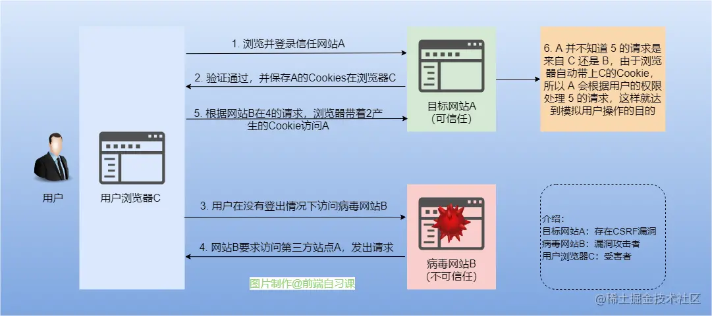

## 1、XSS 攻击（Cross Site Script 跨站脚本攻击）

### 实现方式

XSS 攻击的实现有三种方式——存储型、反射型和文档型。

（1）存储型

存储型的 XSS 将脚本存储到了服务端的数据库，然后在客户端执行这些脚本，从而达到攻击的效果。

（2）反射型

反射型 XSS 指的是恶意脚本作为网络请求的一部分。

`http://sanyuan.com?q=<script>alert("你完蛋了")</script>`

在服务器端会拿到 q 参数,然后将内容返回给浏览器端，浏览器将这些内容作为 HTML 的一部分解析，发现是一个脚本，直接执行，这样就被攻击了。

叫它反射型, 是因为恶意脚本是通过作为网络请求的参数，经过服务器，然后再反射到HTML文档中，执行解析。和存储型不一样的是，服务器并不会存储这些恶意脚本。

（3）文档型

文档型的 XSS 攻击并不会经过服务端，而是作为中间人的角色，在数据传输过程劫持到网络数据包，然后修改里面的 html 文档！

这样的劫持方式包括 WIFI 路由器劫持或者本地恶意软件等。

### 解决办法

永远不要相信用户输入的内容。

- 在服务端对用户可控数据进行过滤和编码操作，如将所有 on 事件、script 等关键字进行过滤，将所有 <, >, ”, ’, = 等特殊符号进行实体化编码或百分号编码便可以修复。
- 客户端，React 可以用 dangerouslySetInnerHTML 来处理。
    - dangerouslySetInnerHTML 并不会格式化传给它的内容，它只会通过 innerHtml 的方式更新内容。比如 `<h1 dangerouslySetInnerHTML={{ __html: '<div onclick="javascript:alert(122)">xx</div>'}} />` 点击文案仍然会出现 alert。
    - dangerouslySetInnerHTML 只是通过语义化的命名（"danger"）警告 —— 它的 prop 值（一个对象而不是字符串）应该被用来表明净化后的数据。
- 利用 CSP，即浏览器中的内容安全策略，它的核心思想就是服务器决定浏览器加载哪些资源，具体来说可以完成以下功能:
    - 限制其他域下的资源加载。
    - 禁止向其它域提交数据。
    - 提供上报机制，能帮助我们及时发现 XSS 攻击。
- 使用 HttpOnly 的 Cookie：在浏览器里运行的 js 脚本是被禁止访问这些 HttpOnly Cookie的，他就无法窃取你在浏览器里存储的重要 Cookie（比如存放用户加密认证信息的 Cookie）了。

## 2、CSRF 攻击（Cross-Site Request Forgery 跨站请求伪造）

CSRF 攻击是攻击者借助受害者的 Cookie 骗取服务器的信任，在受害者毫不知情的情况下以受害者名义伪造请求发送给受攻击服务器，从而在并未授权的情况下执行在权限保护之下的操作。

CSRF 攻击必须具备三个流程：

- 用户登录受信任网站 A，并在本地生成 Cookie。
- 用户在不登出 A 的情况下，访问危险网站 B。
- 危险网站 B 携带 A 的 Cookie 和自定义请求参数，以受害者的名义向 A 网站发起请求。



防范：

（1）Origin 同源检测，直接禁止外域（受信域可以开白名单）对我们发起请求。

（2）CSRF Token，把 Token 以参数的形式加入请求了，提交给服务器判断有效性。比如根据「读写 Cookie 有跨域限制」，服务器通过 cookie 下发一个随机数 token（比如登录后的「登录态 key」），页面发请求的时候从 cookie 取出 token 通过 HTTP 请求参数传给后台，后台比对参数里的 token 和 cookie 里的 token 是否一致，如果一致就证明是自己页面发的请求，如果不一致就返回失败。

（3）Cookie 属性:
- Samesite 设置为 Strict：只允许同源网站提交请求携带 Cookie。实际上这个要求太过严格，会影响自己业务的体验，所以基本不会用它来防止 CSRF 攻击。
- HTTPOnly：这个 Cookie 只能是 HTTP 请求可以读写，js 没有读写权限，浏览器还是会默认带上，所以登录态校验是通过的。如果设置了 HTTPOnly 还有副作用，会让 Token 方案用不了。

（4）验证 Referer，Referer 可以确认 HTTP 请求的来源页面地址。

Referrer 会不会被伪造或者篡改？
- 在浏览器环境下，Referrer 是浏览器自己带上的，js 是改不了 Rerferrer，所以是不能被伪造和篡改的。
- 浏览器插件能改 Referrer 么？答案：能改，但是浏览器插件攻击不属于 CSRF 攻击范畴，不可能在所有用户浏览器都安装上黑客的插件。
- 通过网关或者抓包修改 Referrer？答案：能改，这是中间人攻击，防中间人攻击用 HTTPS。
- 黑客通过自己后台代理，请求发到黑客自己的后台，黑客后台修改 Referrer 再转发到相册后台，可以改么？答案：能改，但行不通，请求发送到黑客自己后台不会带上相册的 Cookie，登录态校验通不过，敏感操作做不了。

总的来说，用 Referrer 防 CSRF 是安全：
- 读操作：只要「不用 JSONP」，「CORS 要白名单」，那么读操作是安全的。
    - 如果后台返回的数据是 JSONP 格式的，这种只能是 Get 操作，是能被黑客页面拿到的。
    - 如果后台是通过 CORS 处理跨域，没有对请求头的 Origin 做白名单限制，ACAO 响应头（access-control-allow-origin）是 `*` 或者包括黑客页面，包括 Get/Post/Del 等操作，也是能被黑客页面拿到的。
- 写操作：不能用 Get，且 Referrer 使用白名单机制，Referrer 在白名单内才放过，Referrer 为空不放过。什么时候会为空？
    - 地址栏直接输入 url 的时候，第一个请求 Referrer 为空，但一般是 html 页面读操作，这种不用防 CSRF。
    - 使用 Referrer-Policy 策略设置 no-referrer 时，Referrer 为空，但为了防黑客，自己的页面不要这样设置。
    - 还有一些 iframe 的特殊使用(以前用来绕过图片防盗链的)也会导致 Referrer 为空，这些情况都不能放过。

（5）Origin 限制

原理跟 Referrer 一样，Origin 请求头是 XHR2.0 里增加的，含义是「发送请求页面的域名，主要目的是解决跨域问题」。如果用来校验 CSRF 请求，就有一些细节要处理好：
- 后台判断 Origin 时也要使用白名单，并且不能为空，不在白名单内的请求都直接返回失败，不能执行请求里的写操作(有一些 web server 是请求执行了，也返回了数据，只是没有配 ACAO 响应头，浏览器收不到，这种情况能限制跨域请求，但是不能防 CSRF 的写操作)。
- 或者自定义 HTTP 请求头，把 HTTP 请求升级为复杂请求，这样在跨域的情况就会先发一个 Option 预检请求，预检请求通不过也就不会执行后面真实请求了。

## 3、网络传输安全（中间人拦截）

在中间人攻击中, 攻击者可以拦截通讯双方的通话并插入新的内容。以 Charles 代理为例，如果客户端信任 Charles 的证书，即可：


防范：
- 个人不要乱连不信任的网络（当然，https 的安全性是建立在证书的信任体系上的）。
- 公司 APP 应该配置禁止被抓包。
- APP 和浏览器都应该严格校验证书，不使用不安全的 APP 和浏览器。

## 4、接口加签

接口加签可防止请求数据被中间人篡改！

服务端网关首先会校验签是不是对的，如果不对直接拒绝请求，而签的生成和请求参数密切相关，当接口请求中的参数被篡改后，网关是没法进行验签通过的，直接拒绝了请求，抛出错误。

## 5、参数加密

有时候我们的参数根本不想被人看见是啥，我们就可以利用参数加密了，如下图：


## 6、接口防重放

某接口，或者某个参数组合，只能请求一次，后端记录下来一旦被请求过，之后就予以拒绝。

## 7、环境检测

（1）是不是浏览器

但 window / document 等对象容易被修改，比如通过 Object.defineProperty 等：

`Object.defineProperty(navigator, 'plugins', { get: () => [1, 2, 3, 4, 5] });`

所以不能过分依赖。

（2）是不是模拟器

比如 webdriver、selenium、electron 就是模拟器。

如果是 webdriver，则 navigator.webdriver 的值等于 true。
但是攻击可以篡改：

```js
// 让 navigator.webdriver 变成 undefined
Object.defineProperty(navigator, 'webdriver', {
	get: () => undefined,
});

// 更彻底一些
delete navigator.__proto__.webdriver
```

（3）有没有用户行为

如通过判断事件上的 [isTrusted](https://developer.mozilla.org/zh-CN/docs/Web/API/Event/isTrusted) 属性来判断是不是真实的事件。

当然也可以通过 defineProperty 绕过：

```js
function clone(e) {
    const t = {};
    for (let attr in e) {
        if (typeof e[attr] === "function") {
            t[attr] = e[attr];
        } else {
            Object.defineProperty(t, attr, {
                get: () => {
                    if (attr === 'isTrusted') {
                        return true;
                    }
                    return e[attr];
                },
                set: v => {
                    e[attr] = v;
                }
            });
        }
    }
    return t;
}
const oldAEL = document.addEventListener;
window.addEventListener = document.addEventListener = function (e, func, c) {
    const newFunc = function (event) {
        const newEvent = clone(event);
        return func(newEvent);
    };
    return oldAEL.call(this, e, newFunc, c);
};
```

## 8、风控和验证码

## 9、代码加密混淆
- 前端加签代码，由于加签是在前端进行的，前端必须存有秘钥和加签规则，但是一旦被第三方知道加签的秘钥和规则，加签也就不公而破了，所以加签的前端代码必须得加密。
- 新型验证码用户行为采集代码，新型验证码涉及很多用户行为的前端采集，然后提交后端分析，如果采集规则被第三方知道，那么攻击者也就很好的进行攻击行为，所以采集代码也是需要加密的。