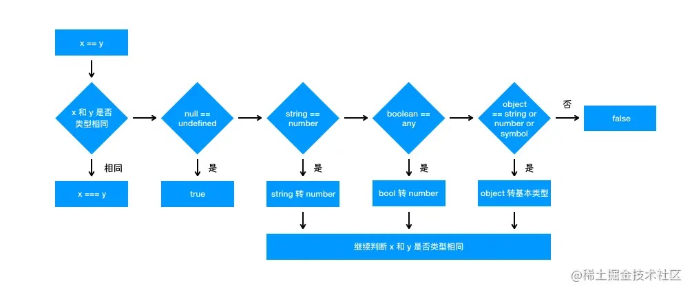
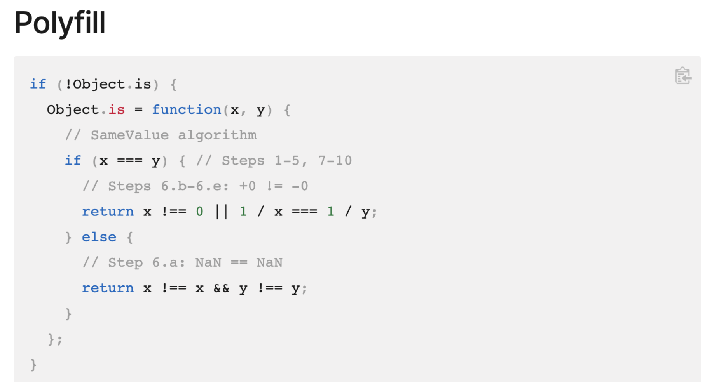

[「2021」高频前端面试题汇总之JavaScript篇（上）](https://juejin.cn/post/6940945178899251230#heading-2)

## 1、JS 类型

JavaScript 的数据类型分为两种：基本数据类型 和 引用数据类型：
- 基本数据类型：7 种，有 Undefined、Null、Boolean、Number、String、Symbol、BigInt，它们也叫简单数据类型 / 原始数据类型，存放方式是「栈」。
- 引用数据类型：统称为 Object 类型，细分的话，有许多种，如 Object、Array、Function、Date、Regexp、Math 类型，还有 Window、Document、Error 等等，引用类型存放方式是「堆」。

### Bigint

一种数字类型的数据，使用 BigInt 可以安全地存储和操作任意精度格式的大整数，即使这个数已经超出了 Number 能够表示的安全整数范围。
要创建一个 bigint，可以在一个整数的末尾添加字符n，或者调用函数 BigInt()。
number 和 bigint 属于不同的数据类型，它们可以相等 ==，但不能严格相等 ===，两者也可以显示转化。
```js
BigInt(10) == 10                    // true
BigInt(10) === 10                   // false
// 显示转化
Number(BigInt(10)) === 10           // true
BigInt(Number(10)) === BigInt(10)   // true
```

## 2、数据类型检测方式

### typeof

```js
console.log(typeof 2);               // number
console.log(typeof true);            // boolean
console.log(typeof 'str');           // string
console.log(typeof undefined);       // undefined
console.log(typeof null);            // object
console.log(typeof []);              // object    
console.log(typeof {});              // object
console.log(typeof function(){});    // function

console.log(typeof Symbol('x'));     // symbol
console.log(typeof BigInt(10));      // bigInt

console.log(typeof window);              // object
console.log(typeof document);            // object
console.log(typeof new RegExp('/^s/g'))  // object
console.log(typeof new Error());         // object
console.log(typeof Math);              // object，注意不是 function

console.log(typeof Window);            // function，虽然是函数，但执行 `new Window()` 报错 `Uncaught TypeError: Illegal constructor`
console.log(typeof Document);          // function，是函数，执行 `new Document()` 得到 document 实例
console.log(typeof RegExp);            // function
console.log(typeof Error);             // function

```

其中数组、对象、null 都会被判断为 object，其他判断都正确。

### instanceof

```js
console.log(2 instanceof Number);                    // false
console.log(true instanceof Boolean);                // false 
console.log('str' instanceof String);                // false
console.log(Symbol('x') instanceof Symbol);          // false
console.log(BigInt(10) instanceof BigInt);           // false
 
console.log([] instanceof Array);                    // true，`[] instanceof Object` 也是 true
console.log(function(){} instanceof Function);       // true
console.log({} instanceof Object);                   // true
console.log(new Date() instanceof Date);            // true

console.log(Math instanceof Object);       // true，Math 是内置的一种 Object，直接继承于 Object，不算function。
console.log(window instanceof Window);     // true
console.log(document instanceof HTMLDocument); // true，因为 HTMLDocument.prototype.__proto__ 是 Document，所以 `document instanceof Document` 也是 true，但 `new Document() instanceof HTMLDocument` 是 false
console.log(/^s/g instanceof RegExp);      // true
console.log(new Error() instanceof Error); // true
```

instanceof 只能正确判断引用数据类型，而不能判断基本数据类型。instanceof 运算符可以用来测试一个对象在其原型链中是否存在一个构造函数的 prototype 属性。

### Object.prototype.toString.call()

```js
a = Object.prototype.toString;
 
console.log(a.call(2));                     // [object Number]
console.log(a.call(true));                  // [object Boolean]
console.log(a.call('str'));                 // [object String]
console.log(a.call([]));                    // [object Array]
console.log(a.call(function(){}));          // [object Function]
console.log(a.call({}));                    // [object Object]
console.log(a.call(undefined));             // [object Undefined]
console.log(a.call(null));                  // [object Null]
console.log(a.call(Symbol('x')));           // [object Symbol]
console.log(a.call(BigInt(10)));            // [object BigInt]

console.log(a.call(Math));                  // [object Math]
console.log(a.call(window));                // [object Window]
console.log(a.call(document));              // [object HTMLDocument]
console.log(a.call(/^s/g));                 // [object RegExp]
console.log(a.call(new Error()));           // [object Error]
```

注意不能直接 toString，对象和数组就改写了该方法，比如 `'xx'.toString()` 和 `['xx'].toString()` 都输出 `'xxx'`

### constructor

```js
console.log((2).constructor === Number);                // true
console.log((true).constructor === Boolean);            // true
console.log(('str').constructor === String);            // true
console.log(([]).constructor === Array);                // true
console.log((function() {}).constructor === Function);  // true
console.log(({}).constructor === Object);               // true
console.log((Symbol('x')).constructor === Symbol);      // true
console.log((BigInt(10)).constructor === BigInt);       // true

console.log(Math.constructor === Object);               // true，注意是 Object
console.log(window.constructor === Window);             // true
console.log(document.constructor === HTMLDocument);     // true，注意是 HTMLDocument 而不是 Document
console.log(/^s/g.constructor === Regex);               // true
console.log((new Error()).constructor === Error);       // true
```

## 3、ToPrimitive

ToPrimitive 是 JavaScript 中每个值隐含的自带的方法，用来将值 （无论是基本类型值还是对象）转换为基本类型值。如果值为对象，其看起来大概是这样：

```js
/**
* @obj 需要转换的对象
* @type 期望的结果类型
*/
ToPrimitive(obj, type)
```

默认情况下：

- 如果对象为 Date 对象，则 type 默认为 string；
- 其他情况下，type默认为number。

调用 toString 和 valueOf 的先后顺序：
- 如果 type 是 number，先调用 obj 的 valueOf，不行再调用 toString，不行就抛出 TypeError 异常，比如 `{x: 1} == 2`。
- 如果 type 是 string，先调用 obj 的 toString，不行再调用 valueOf，不行就抛出 TypeError 异常，比如 `{x: 1} == 'x'`。

上述 `{x: 1}` 都会得到 '[object Object]'。

## 4、隐式转化

+、-、*、/ 以及 <、>、== 这些运算符只能操作基本类型值，所以在进行这些运算前的第一步就是将两边的值用 ToPrimitive 转换成基本类型，再进行操作。

（1）+ 操作符

- `+` 操作符的两边有至少一个string类型变量时，两边的变量都会被隐式转换为字符串；
- 其他情况下两边的变量都会被转换为数字。

```js
1 + '23'        // '123'
1 + false       // 1 
1 + Symbol()    // Uncaught TypeError: Cannot convert a Symbol value to a number
'1' + false     // '1false'
false + true    // 1
```

（2）-、*、\ 操作符

和 + 的区别是：即使运算的是 string，也是转为数字。

```js
2 - '23'        // -21
'231' - '1'     // 230
1 * '23'        // 23，NaN 也是一个数字
1 * false       // 0
1 / 'aa'        // NaN
```

（3）< 和 > 比较符
如果两边都是字符串，则比较字母表顺序。

```js
'a' > 'A'       // true
```

否则转换为数字再比较：
```js
let  a = {}
a > -1          // false

// 转换过程如下：
a.valueOf() // {}, 上面提到过，ToPrimitive 遇到非 Date 类型，默认 type 为number，所以先 valueOf，结果还是个对象，下一步
a.toString() // "[object Object]"，现在是一个字符串了
Number(a.toString()) // 继续转化为数字 NaN，根据上面 < 和 > 操作符的规则，要转换成数字
NaN > -1 // false，得出比较结果
```

（4）== 操作符

> [相等性比较 MDN](https://developer.mozilla.org/zh-CN/docs/Web/JavaScript/Equality_comparisons_and_sameness)

undefined == null：true

number == string：判断两者类型是否为 string 和 number，是的话就会将字符串转换为 number。

```js
1 == '1'
      ↓
1 ==  1
```

string == boolean：判断其中一方是否为 boolean，是的话就会把 boolean 转为 number 再进行判断

```js
'1' == true
        ↓
'1' ==  1
        ↓
 1  ==  1
```

相应地，`'2' == true` 则得到 false。

object === any：object 转基础类型，事实上，所有引用类型和基础类型比较，都会先转为基础类型。



## 5、isNaN
```js
Number.isNaN('ab')  // false
isNaN('ab')         // true

Number.isNaN('22')  // false
isNaN('22')         // false
```

Number.isNaN 入参如果是数字再判断是否为 NaN，不是数字则返回 false。

而 isNaN 先将入参转换为数值，再判断是否为 NaN，任何不能被转换为数值的的值都会返回 true。

Tip：`Number.isNaN(Number('122'))` 可以简写为 `isNaN('122')`

## 6、Object.is

[Object.is MDN](https://developer.mozilla.org/zh-CN/docs/Web/JavaScript/Reference/Global_Objects/Object/is)

```js
Object.is()                 // true，因为 undefined === undefined
Object.is(undefined)        // true，因为 undefined === undefined
Object.is(undefined, null)  // false，因为 undefined !== null

+0 === -0                   // true
1/(+0) === 1/(-0)           // false      
Object.is(+0, -0)           // false

NaN === NaN                 // false
Object.is(+NaN, -NaN)       // true
Object.is(NaN, NaN)         // true
```


## 7、var、let、const

（1）var 存在变量提升、let / const 不存在变量提升。

```js
// var：
console.log('...a', a)
var a = 1
// 输出：...a undefined

// let / const：
console.log('...b', b)
let b = 2
// 输出：Uncaught ReferenceError: b is not defined
```
（2）var 可以被重复赋值，let / const 不能被重复赋值：

```js
// var：
var c = 1;
var c = 2;
// 当前 c 的值为 2

// let / const：
let d = 1;
let d = 2;
// 报错：Uncaught SyntaxError: Identifier 'd' has already been declared

```
（3）const 声明时必须设置初始值，var / let 不必须：

```js
const x
// 输出：Uncaught SyntaxError: Missing initializer in const declaration
```

## 8、普通函数、箭头函数和 this

通过普通函数创建一个对象：

- 创建一个对象
- 将构造函数的作用域赋给新对象（也就是将对象的 __proto__ 属性指向构造函数的 prototype 属性）
- 构造函数中的 this 指向该对象（也就是为这个对象添加属性和方法）
- 返回新的对象

箭头函数是 ES6 中的提出来的，它没有 prototype ，也没有自己的 this 指向（this 指向外层的执行环境），更不可以使用 arguments 参数，所以上面的第二、三步，箭头函数都是没有办法执行的。

this 指向：

```js
var id = 'GLOBAL';
var obj = {
  id: 'OBJ',
  a: function(){
    console.log(this.id);
  },
  b: () => {
    console.log(this.id);
  }
};
obj.a();        // 'OBJ'
obj.b();        // 'GLOBAL'
new obj.a()     // undefined
new obj.b()     // Uncaught TypeError: obj.b is not a constructor
```

定义对象的大括号 {} 是无法形成一个单独的执行环境的，它依旧是处于全局执行环境中。
如果把上述两个 var 都改成 let，`obj.b()` 会是 undefined，其他没区别。
此外，call()、apply()、bind() 等方法不能改变箭头函数中的 this 指向。

```js
const obj = { 
  getArrow() { 
    return () => { 
      console.log(this === obj); 
    }; 
  } 
}
obj.getArrow()()        // true，因为进入 getArrow() 函数体就会把 this 设置为 obj。
```

## 9、Map 和 Object 的主要区别

- Map 的键可以是任意值，Object 的键必须是 String 或是 Symbol。
- Map 的 key 是有序的，当迭代时 Map 对象以插入的顺序返回键值，Object 的键是无序的。
- Map 在频繁增删键值对的场景下表现更好，Object 则未做优化。

另外，WeakMap 键必须是对象，原始数据类型不能作为key值。

## 10、函数 arguments

arguments 是一个对象，它的属性是从 0 开始依次递增的数字，还有 callee 和 length 等属性，与数组相似；但是它却没有数组常见的方法属性如 forEach, reduce 等，所以叫它们类数组。

遍历类数组，有三个方法：

- Array.prototype.forEach.call(arguments, cb)
- Array.from(arguments) 转为数组
- [...arguments] 转为数组

## 11、DOM 和 BOM

BOM 指的是浏览器对象模型，核心是 window。
DOM 的最根本的对象 document 对象也是 BOM 的 window 对象的子对象。

## 12、encodeURI、encodeURIComponent、escape 的区别

- encodeURI：对整个 URI 进行转义，将 URI 中的非法字符转换为合法字符，对 URI 中有特殊意义的字符不会进行转义。
- encodeURIComponent：对 URI 的组成部分包括一些特殊字符都会得到转义。
- escape：和 encodeURI 的作用相同，不过它们对于 unicode 编码为 0xff 之外字符的时候会有区别，escape 是直接在字符的 unicode 编码前加上 %u，而 encodeURI 首先会将字符转换为 UTF-8 的格式，再在每个字节前加上 %。

## 13、实现一个 ajax 请求

```js
let xhr = new XMLHttpRequest()
// xhr.open(method, url, async, username, password);
// 其中 async 表示请求是否为异步，默认为 true
xhr.open('get', url, true) 

xhr.onreadystatechange = function() {
  if (this.readyState === 4) {
    return
  }
  if (this.status === 200) {
    cb(this.response)
  } else {
    console.error(this.statusText)
  }
}
xhr.onerror = function () {
  console.error(this.statusText)
}
xhr.responseType = 'json'
xhr.setRequestHeader('Accept', 'application/json')
xhr.send(null)
```

## 14、XMLHttpRequest

readyState：
- 0: UNSENT	            代理被创建，但尚未调用 open() 方法。
- 1: OPENED	            open() 方法已经被调用。
- 2: HEADERS_RECEIVED	send() 方法已经被调用，并且头部和状态已经可获得。
- 3: LOADING	        下载中，responseText 属性已经包含部分数据。
- 4: DONE	            下载操作已完成。

status：返回了 XMLHttpRequest 响应中的数字状态码。

response：返回响应的正文。

## 15、什么是尾调用，使用尾调用有什么好处

尾调用指的是函数的最后一步调用另一个函数。代码执行是基于执行栈的，所以当在一个函数里调用另一个函数时，会保留当前的执行上下文，然后再新建另外一个执行上下文加入栈中。使用尾调用的话，因为已经是函数的最后一步，所以这时可以不必再保留当前的执行上下文，从而节省了内存，这就是尾调用优化。

但是 ES6 的尾调用优化只在严格模式下开启，正常模式是无效的。

## 16、for...in, for...of 等

```js
let obj = {
    0:'one',
    1:'two',
    length: 2
};
Array.from(obj);        // ['one', 'two']
Object.values(obj)      // ['one', 'two', 2]

Object.keys(obj)        // ['0', '1', 'length']
for(let k in obj) { console.log(k) }    // 0  1 length
```

- for...in 会遍历对象的整个原型链，性能较差，而 for...of 只遍历当前对象不会遍历原型链；
- 对于对象的遍历，for...in 可以进行，但 for。..of 遍历会报错 `Uncaught TypeError: obj is not iterable`；
- 对于数组的遍历，for...in 会返回数组中所有可枚举的属性(包括原型链上可枚举的属性)，for...of 只返回数组的下标对应的属性值。

## 17、ajax、fetch、axios 的区别

fetch 号称是 ajax 的替代品，是在 ES6 出现的，使用了 ES6 中的 promise 对象，支持 async/await。

fetch 不支持 abort 和超时控制，不能和 XHR 一样监测请求的进度。

Axios 在浏览器端发起 XHR 请求，node 端发起 http 请求。客户端支持抵御 XSRF 攻击。

## 18、原型链

当访问一个对象的属性时，如果这个对象内部不存在这个属性，那么它就会去它的原型对象里找这个属性，这个原型对象又会有自己的原型，于是就这样一直找下去，也就是原型链的概念。

原型链的尽头一般来说都是 Object.prototype 所以这就是新建的对象为什么能够使用 toString() 等方法的原因。
而进一步的尽头则是 Object.prototype.__proto__ 即 null，所以原型链的终点是null。

```js
function Person(name) {
    this.name = name
}
let p = Person('xx')

p.__proto__ === Person.prototype        // true
p.constructor === Person                // true

Person.prototype                                // { constructor: function Person(){} }
Person.prototype.constructor === Person         // true，函数的原型的构造函数指向函数本身
Person.prototype.__proto__ === Object.prototype // true

//顺便学习一下 ES5 的方法,可以获得对象得原型。调用 obj.__proto__ 可以理解成返回了 Object.getPrototypeOf(obj)
Object.getPrototypeOf(person) === Person.prototype // true
```

除了最顶层的Object对象没有__proto_，其他所有的对象都有__proto__，这是隐式原型。
此外，可使用 hasOwnProperty() 方法来判断属性是否属于自身属性（即非原型链的属性）。

## 19、执行上下文

当 JavaScript 执行代码时，首先遇到全局代码，会创建一个全局执行上下文并且压入执行栈中，每当遇到一个函数调用，就会为该函数创建一个新的执行上下文并压入栈顶，引擎会执行位于执行上下文栈顶的函数，当函数执行完成之后，执行上下文从栈中弹出，继续执行下一个上下文。当所有的代码都执行完毕之后，从栈中弹出全局执行上下文。

## 20、对象深拷贝

考虑 null、object、array：

```js
const deepClone = obj => {
  if (obj === null) return null;
  let clone = Object.assign({}, obj);
  Object.keys(clone).forEach(
    key =>
      (clone[key] =
        typeof obj[key] === 'object' ? deepClone(obj[key]) : obj[key])
  );
  if (Array.isArray(obj)) {
    clone.length = obj.length;
    return Array.from(clone);
  }
  return clone;
};

```

考虑更多类型：

```js
function deepClone(obj, hash = new WeakMap()) {
  if (obj === null) return obj; // 如果是null或者undefined我就不进行拷贝操作
  if (obj instanceof Date) return new Date(obj);
  if (obj instanceof RegExp) return new RegExp(obj);
  // 可能是对象或者普通的值  如果是函数的话是不需要深拷贝
  if (typeof obj !== "object") return obj;
  // 是对象的话就要进行深拷贝
  if (hash.get(obj)) return hash.get(obj);
  let cloneObj = new obj.constructor();
  // 找到的是所属类原型上的constructor,而原型上的 constructor指向的是当前类本身
  hash.set(obj, cloneObj);
  for (let key in obj) {
    if (obj.hasOwnProperty(key)) {
      // 实现一个递归拷贝
      cloneObj[key] = deepClone(obj[key], hash);
    }
  }
  return cloneObj;
}
let obj = { name: 1, address: { x: 100 } };
obj.o = obj; // 对象存在循环引用的情况
let d = deepClone(obj);
obj.address.x = 200;
console.log(d);
```

## 21、Event Loop

TODO

## 22、什么是闭包，闭包的作用是什么？

当一个内部函数被调用，就会形成闭包，闭包就是能够读取其他函数内部变量的函数。
闭包作用：局部变量无法共享和长久的保存，而全局变量可能造成变量污染，所以我们希望有一种机制既可以长久的保存变量又不会造成全局污染。

## 23、在地址栏里输入一个地址回车会发生哪些事情

（1）解析 URL：首先会对 URL 进行解析，分析所需要使用的传输协议和请求的资源的路径。如果输入的 URL 中的协议或者主机名不合法，将会把地址栏中输入的内容传递给搜索引擎。如果没有问题，浏览器会检查 URL 中是否出现了非法字符，如果存在非法字符，则对非法字符进行转义后再进行下一过程。

（2）缓存判断：浏览器会判断所请求的资源是否在缓存里，如果请求的资源在缓存里并且没有失效，那么就直接使用，否则向服务器发起新的请求。

（3）DNS 解析： 下一步首先需要获取的是输入的 URL 中的域名的 IP 地址，首先会判断本地是否有该域名的 IP 地址的缓存，如果有则使用，如果没有则向本地 DNS 服务器发起请求。本地 DNS 服务器也会先检查是否存在缓存，如果没有就会先向根域名服务器发起请求，获得负责的顶级域名服务器的地址后，再向顶级域名服务器请求，然后获得负责的权威域名服务器的地址后，再向权威域名服务器发起请求，最终获得域名的 IP 地址后，本地 DNS 服务器再将这个 IP 地址返回给请求的用户。用户向本地 DNS 服务器发起请求属于递归请求，本地 DNS 服务器向各级域名服务器发起请求属于迭代请求。

（4）获取 MAC 地址：当浏览器得到 IP 地址后，数据传输还需要知道目的主机 MAC 地址，因为应用层下发数据给传输层，TCP 协议会指定源端口号和目的端口号，然后下发给网络层。网络层会将本机地址作为源地址，获取的 IP 地址作为目的地址。然后将下发给数据链路层，数据链路层的发送需要加入通信双方的 MAC 地址，本机的 MAC 地址作为源 MAC 地址，目的 MAC 地址需要分情况处理。通过将 IP 地址与本机的子网掩码相与，可以判断是否与请求主机在同一个子网里，如果在同一个子网里，可以使用 ARP（地址解析协议）获取到目的主机的 MAC 地址，如果不在一个子网里，那么请求应该转发给网关，由它代为转发，此时同样可以通过 ARP 协议来获取网关的 MAC 地址，此时目的主机的 MAC 地址应该为网关的地址。

（5）TCP 三次握手：首先客户端向服务器发送一个 SYN 连接请求报文段和一个随机序号（同步位 SYN 置为 1，随机序号 seq = x），服务端接收到请求后向客户端发送一个 SYN ACK 报文段和一个随机序号（确认位 ACK = 1，确认号 ack = x + 1，同步位 SYN = 1，随机序号 seq = y）。客户端接收服务器的确认应答后，进入连接建立的状态，同时向服务器也发送一个 ACK 确认报文段（确认位 ACK = 1，确认号 ack = y + 1，seq = x + 1），服务器端接收到确认后连接建立。

（6）HTTPS 握手：如果使用的是 HTTPS 协议，在通信前还存在 TLS 的一个四次握手的过程。首先由客户端向服务器端发送使用的协议的版本号、一个随机数和可以使用的加密方法。服务器端收到后，确认加密的方法，也向客户端发送一个随机数和自己的数字证书。客户端收到后，首先检查数字证书是否有效，如果有效，则再生成一个随机数，并使用证书中的公钥对随机数加密，然后发送给服务器端，并且还会提供一个前面所有内容的 hash 值供服务器端检验。服务器端接收后，使用自己的私钥对数据解密，同时向客户端发送一个前面所有内容的 hash 值供客户端检验。这个时候双方都有了三个随机数，按照之前所约定的加密方法，使用这三个随机数生成一把秘钥，以后双方通信前，就使用这个秘钥对数据进行加密后再传输。

（7）返回数据：当页面请求发送到服务器端后，服务器端会返回一个 html 文件作为响应，浏览器接收到响应后，开始对 html 文件进行解析，开始页面的渲染过程。

（8）页面渲染：浏览器首先会根据 html 文件构建 DOM 树，根据解析到的 css 文件构建 CSSOM 树，如果遇到 script 标签，则判断是否含有 defer 或者 async 属性，要不然 script 的加载和执行会造成页面的渲染的阻塞。当 DOM 树和 CSSOM 树建立好后，根据它们来构建渲染树。渲染树构建好后，会根据渲染树来进行布局。布局完成后，最后使用浏览器的 UI 接口对页面进行绘制。这个时候整个页面就显示出来了。

（9）TCP 四次挥手：最后一步是 TCP 断开连接的四次挥手过程。
- C -> S：若客户端认为数据发送完成，则它需要向服务端发送连接释放请求，进入 FIN_WAIT（FIN = 1，随机序号 seq = m）。
- S -> C：服务端收到连接释放请求后，会告诉应用层要释放 TCP 链接。然后会发送 ACK 包，并进入 CLOSE_WAIT 状态（确认位置 ACK = 1，ack = m + 1），此时表明客户端到服务端的连接已经释放，不再接收客户端发的数据了。但是因为 TCP 连接是双向的，所以服务端仍旧可以发送数据给客户端
- S -> C：服务端数据发送完毕后会向客户端发送连接释放请求，然后服务端便进入 LAST-ACK 状态（FIN = 1，随机序号 seq = n）。
- C -> S：客户端收到释放请求后，向服务端发送确认应答，此时客户端进入 TIME-WAIT 状态（确认位置 ACK = 1，ack = n + 1）。该状态会持续 2MSL（最大段生存期，指报文段在网络中生存的时间，超时会被抛弃）时间，若该时间段内没有服务端的重发请求的话，就进入 CLOSED 状态。当服务端收到确认应答后，也便进入 CLOSED 状态。


## 24、TCP 三次握手、四次挥手

（1）为什么需要三次握手才能建立连接？

第三次是客户端确认「服务端的确认」，如果只有两次握手，客户端没有回应，会浪费服务端的资源。

（2）如果握手时客户端发送的 SYN 丢失了或者其他原因导致 Server 无法处理，怎么处理？

在 TCP 的可靠传输中，如果 SYN 包在传输的过程中丢失，此时 Client 会触发重传机制，但是也不是无脑的一直重传过去，重传的次数是受限制的，可以通过 tcp_syn_retries 这个配置项来决定。如果此时 tcp_syn_retries 的配置为 3，表示重传三次，意味着当第一次发送SYN后，需要等待(1 +2 +4 +8)秒，如果还是没有响应，connect就会通过 ETIMEOUT 的错误返回。


（3）为什么连接的时候是三次握手，关闭的时候却是四次握手？

因为 当 Server 端收到客服端 FIN 报文时，很可能并不会立即关闭 SOCKET。所以只能先回复一个 ACK 报文，告诉 Client 端 “你发的 FIN 报文我收到了”。只有等到我 Server 端所有的报文都发送完了，我才能发送 FIN 报文，因此不能一起发送。故需要四步握手。

> 四次挥手的情景大致是这样的：
- 客户端主机 C 说：“我没有数据了，断开连接吧。 ”
- 服务器 S 说：“好，但是我还有数据（不断给 C 发送数据，此时 C 已经不能给 S 发送数据了，但是必须要就收 S 发来的数据）。”
- （当 S 给 C 发完数据后）S 说：“我发完了，断开连接吧。”
- C 说：“好，断开连接吧。”

## 25、性能监控和优化

TODO

## 26、浏览器同源策略和跨域方案

浏览器同源策略：同源是指"协议+域名+端口"三者相同，即便两个不同的域名指向同一个 ip 地址，也非同源。
限制以下行为：
- Cookie、LocalStorage 和 IndexDB 无法读取
- DOM 和 Js对象无法获得
- AJAX 请求不能发送

有三个标签是允许跨域加载资源，iconfont 字体文件(eot|otf|ttf|woff|svg)则不允许：
```html

<link href=XXX>
<script src=XXX>
```

解决方案：
- 通过 jsonp 跨域，如定义好 callback 然后添加 script 标签，设置 `script.src = 'http://www.domain2.com:8080/login?user=admin&callback=cb'`。服务端返回数据时会将这个callback 参数作为函数名来包裹住 JSON 数据。
- document.domain + iframe 跨域。
- location.hash + iframe，通过 url hash 跨 iframe 通信。
- window.name + iframe 跨域：name值在不同的页面（甚至不同域名）加载后依旧存在，并且可以支持非常长的 name 值（2MB）。
- postMessage：一般用于解决以下问题
  - 页面和其打开的新窗口的数据传递
  - 多窗口之间消息传递
  - 页面与嵌套的 iframe 消息传递
  - 上面三个场景的跨域数据传递
- 跨域资源共享（CORS）：主流的跨域解决方案。服务端设置 Access-Control-Allow-Origin 即可
- nginx 代理跨域和 nodejs 中间件代理跨域。

TODO

## Object.keys, for-in, for-of, in, etc


## setTimeout & ……


