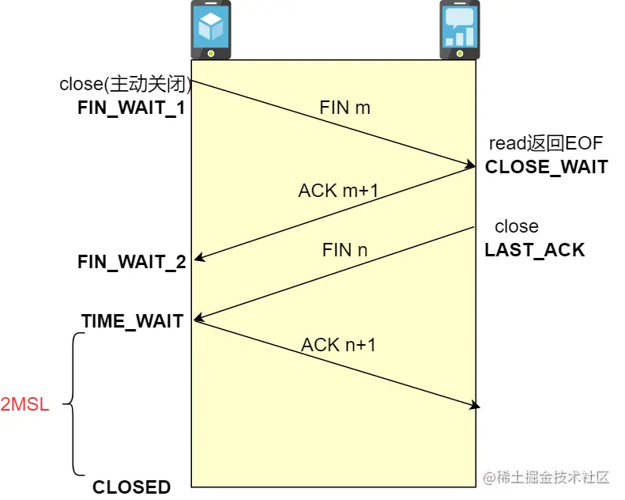
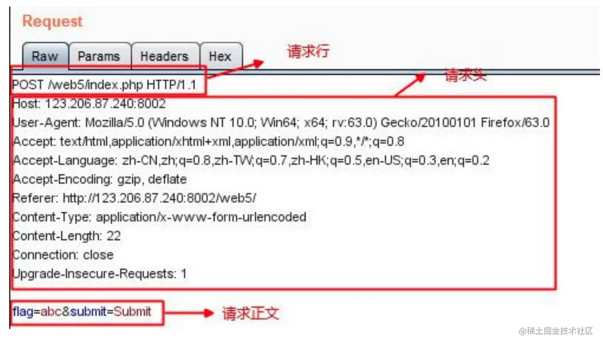
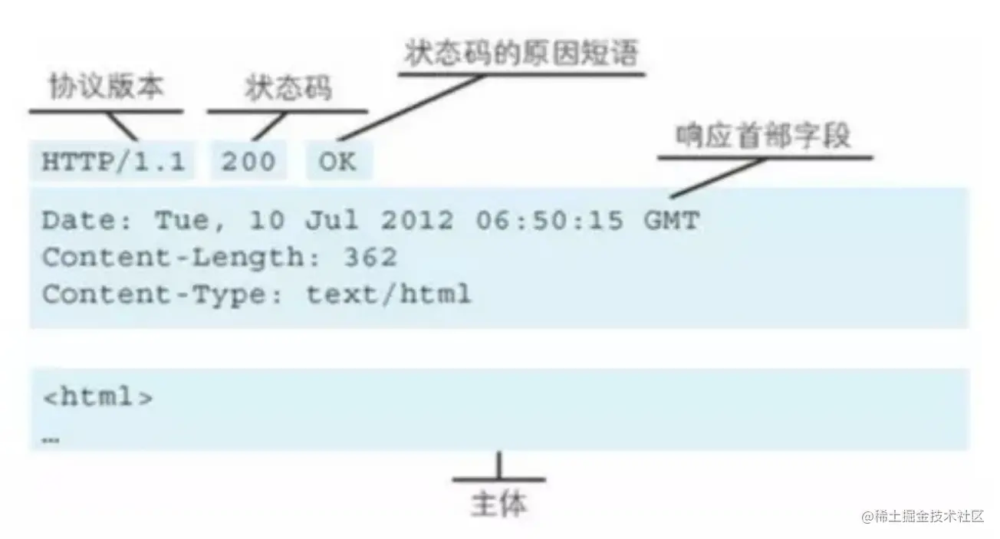
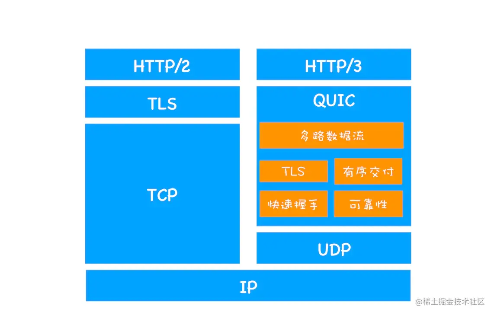
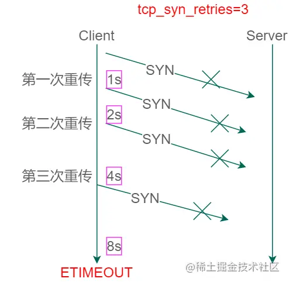
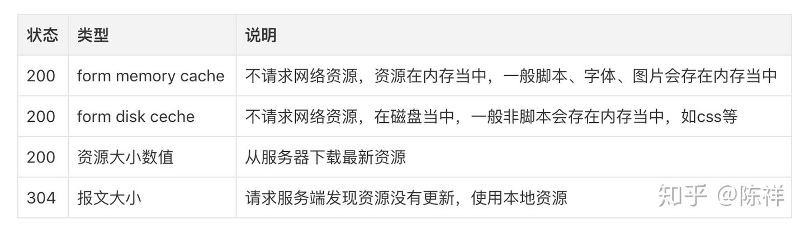
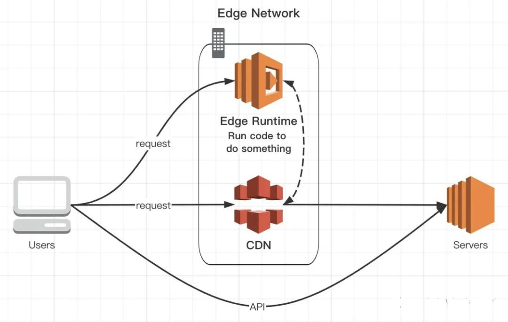

# 浏览器

## 浏览器有哪些进程

Chrome 浏览器使用的是多进程多线程模式，因为现在的网页复杂性非常高。如果整个浏览器是单进程的，有可能某个 page 界面的抛错就会导致整个浏览器的 crash。同时多个界面互相可以访问相同的内存和相同的执行环境，安全性也是一个大的问题，所以浏览器需要采用多进程模式。

浏览器的进程大概分为以下这几种：

（1）浏览器主进程(Browser进程)：控制 chrome 的地址栏，书签栏，返回和前进按钮，同时还有浏览器的不可见部分，例如网络请求和文件访问。

（2）第三方插件进程：每种插件一个进程，插件运行时才会创建。

（3）浏览器渲染进程（浏览器内核，内部是多线程的）：负责界面渲染，脚本执行，事件处理等。

（4）GPU 进程：最多一个，用于 3D 绘制。

 

## 浏览器有哪些线程

浏览器的渲染进程是多线程的。js 是阻塞单线程的。浏览器包含有以下线程：

（1）GUI 渲染线程
负责渲染浏览器界面，解析 HTML，CSS，构建 DOM 树和 RenderObject 树，布局和绘制等。
当界面需要重绘（Repaint）或由于某种操作引发回流(reflow)时，该线程就会执行。
注意，GUI 渲染线程与 JS 引擎线程是互斥的，当 JS 引擎执行时 GUI 线程会被挂起（相当于被冻结了），GUI 更新会被保存在一个队列中等到 JS 引擎空闲时立即被执行。

（2）JS 引擎线程
也称为 JS 内核，负责处理 Javascript 脚本程序。（例如V8引擎）
JS 引擎线程负责解析 Javascript 脚本，运行代码。
JS 引擎一直等待着任务队列中任务的到来，然后加以处理，一个Tab页（renderer 进程）中无论什么时候都只有一个 JS 线程在运行 JS 程序。
同样注意，GUI 渲染线程与 JS 引擎线程是互斥的，所以如果 JS 执行的时间过长，这样就会造成页面的渲染不连贯，导致页面渲染加载阻塞。

（3）事件触发线程
归属于浏览器而不是 JS 引擎，用来控制事件循环（可以理解，JS 引擎自己都忙不过来，需要浏览器另开线程协助）
当 JS 引擎执行代码块如 setTimeOut 时（也可来自浏览器内核的其他线程,如鼠标点击、AJAX 异步请求等），会将对应任务添加到事件线程中
当对应的事件符合触发条件被触发时，该线程会把事件添加到待处理队列的队尾，等待 JS 引擎的处理
注意，由于 JS 的单线程关系，所以这些待处理队列中的事件都得排队等待 JS 引擎处理（当 JS 引擎空闲时才会去执行）

（4）定时触发器线程
传说中的 setInterval 与 setTimeout 所在线程
浏览器定时计数器并不是由 JavaScript 引擎计数的,（因为 JavaScript 引擎是单线程的，如果处于阻塞线程状态就会影响记计时的准确）
因此通过单独线程来计时并触发定时（计时完毕后，添加到事件队列中，等待 JS 引擎空闲后执行）
注意，W3C 在HTML标准中规定，规定要求 setTimeout 中低于 4ms 的时间间隔算为 4ms。

（5）异步 http 请求线程
在 XMLHttpRequest 在连接后是通过浏览器新开一个线程请求。
将检测到状态变更时，如果设置有回调函数，异步线程就产生状态变更事件，将这个回调再放入事件队列中。再由 JavaScript 引擎执行。

## 浏览器同源策略和跨域方案

浏览器同源策略：同源是指"协议+域名+端口"三者相同，即便两个不同的域名指向同一个 ip 地址，也非同源。
限制以下行为：
- Cookie、LocalStorage 和 IndexDB 无法读取
- DOM 和 Js对象无法获得
- AJAX 请求不能发送

有三个标签是允许跨域加载资源，iconfont 字体文件(eot|otf|ttf|woff|svg)则不允许：
```html

<link href=XXX>
<script src=XXX>
```

解决方案：
- 通过 jsonp 跨域，如定义好 callback 然后添加 script 标签，设置 `script.src = 'http://www.domain2.com:8080/login?user=admin&callback=cb'`。服务端返回数据时会将这个callback 参数作为函数名来包裹住 JSON 数据。
- document.domain + iframe 跨域。
- location.hash + iframe，通过 url hash 跨 iframe 通信。
- window.name + iframe 跨域：name值在不同的页面（甚至不同域名）加载后依旧存在，并且可以支持非常长的 name 值（2MB）。
- postMessage：一般用于解决以下问题
  - 页面和其打开的新窗口的数据传递
  - 多窗口之间消息传递
  - 页面与嵌套的 iframe 消息传递
  - 上面三个场景的跨域数据传递
- 跨域资源共享（CORS）：主流的跨域解决方案。服务端设置 Access-Control-Allow-Origin 即可
- nginx 代理跨域和 nodejs 中间件代理跨域。

## 在地址栏里输入一个地址回车会发生哪些事情

（1）解析 URL：首先会对 URL 进行解析，分析所需要使用的传输协议和请求的资源的路径。如果输入的 URL 中的协议或者主机名不合法，将会把地址栏中输入的内容传递给搜索引擎。如果没有问题，浏览器会检查 URL 中是否出现了非法字符，如果存在非法字符，则对非法字符进行转义后再进行下一过程。

（2）缓存判断：浏览器会判断所请求的资源是否在缓存里，如果请求的资源在缓存里并且没有失效，那么就直接使用，否则向服务器发起新的请求。

（3）DNS 解析： 下一步首先需要获取的是输入的 URL 中的域名的 IP 地址，首先会判断本地是否有该域名的 IP 地址的缓存，如果有则使用，如果没有则向本地 DNS 服务器发起请求。本地 DNS 服务器也会先检查是否存在缓存，如果没有就会先向根域名服务器发起请求，获得负责的顶级域名服务器的地址后，再向顶级域名服务器请求，然后获得负责的权威域名服务器的地址后，再向权威域名服务器发起请求，最终获得域名的 IP 地址后，本地 DNS 服务器再将这个 IP 地址返回给请求的用户。用户向本地 DNS 服务器发起请求属于递归请求，本地 DNS 服务器向各级域名服务器发起请求属于迭代请求。

（4）获取 MAC 地址：当浏览器得到 IP 地址后，数据传输还需要知道目的主机 MAC 地址，因为应用层下发数据给传输层，TCP 协议会指定源端口号和目的端口号，然后下发给网络层。网络层会将本机地址作为源地址，获取的 IP 地址作为目的地址。然后将下发给数据链路层，数据链路层的发送需要加入通信双方的 MAC 地址，本机的 MAC 地址作为源 MAC 地址，目的 MAC 地址需要分情况处理。通过将 IP 地址与本机的子网掩码相与，可以判断是否与请求主机在同一个子网里，如果在同一个子网里，可以使用 ARP（地址解析协议）获取到目的主机的 MAC 地址，如果不在一个子网里，那么请求应该转发给网关，由它代为转发，此时同样可以通过 ARP 协议来获取网关的 MAC 地址，此时目的主机的 MAC 地址应该为网关的地址。

（5）TCP 三次握手：首先客户端向服务器发送一个 SYN 连接请求报文段和一个随机序号（同步位 SYN 置为 1，随机序号 seq = x），服务端接收到请求后向客户端发送一个 SYN ACK 报文段和一个随机序号（确认位 ACK = 1，确认号 ack = x + 1，同步位 SYN = 1，随机序号 seq = y）。客户端接收服务器的确认应答后，进入连接建立的状态，同时向服务器也发送一个 ACK 确认报文段（确认位 ACK = 1，确认号 ack = y + 1，seq = x + 1），服务器端接收到确认后连接建立。

（6）HTTPS 握手：如果使用的是 HTTPS 协议，在通信前还存在 TLS 的一个四次握手的过程。首先由客户端向服务器端发送使用的协议的版本号、一个随机数和可以使用的加密方法。服务器端收到后，确认加密的方法，也向客户端发送一个随机数和自己的数字证书。客户端收到后，首先检查数字证书是否有效，如果有效，则再生成一个随机数，并使用证书中的公钥对随机数加密，然后发送给服务器端，并且还会提供一个前面所有内容的 hash 值供服务器端检验。服务器端接收后，使用自己的私钥对数据解密，同时向客户端发送一个前面所有内容的 hash 值供客户端检验。这个时候双方都有了三个随机数，按照之前所约定的加密方法，使用这三个随机数生成一把秘钥，以后双方通信前，就使用这个秘钥对数据进行加密后再传输。

（7）返回数据：当页面请求发送到服务器端后，服务器端会返回一个 html 文件作为响应，浏览器接收到响应后，开始对 html 文件进行解析，开始页面的渲染过程。

（8）页面渲染：浏览器首先会根据 html 文件构建 DOM 树，根据解析到的 css 文件构建 CSSOM 树，如果遇到 script 标签，则判断是否含有 defer 或者 async 属性，要不然 script 的加载和执行会造成页面的渲染的阻塞。当 DOM 树和 CSSOM 树建立好后，根据它们来构建渲染树。渲染树构建好后，会根据渲染树来进行布局。布局完成后，最后使用浏览器的 UI 接口对页面进行绘制。这个时候整个页面就显示出来了。

（9）TCP 四次挥手：最后一步是 TCP 断开连接的四次挥手过程。
- C -> S：若客户端认为数据发送完成，则它需要向服务端发送连接释放请求，进入 FIN_WAIT（FIN = 1，随机序号 seq = m）。
- S -> C：服务端收到连接释放请求后，会告诉应用层要释放 TCP 链接。然后会发送 ACK 包，并进入 CLOSE_WAIT 状态（确认位置 ACK = 1，ack = m + 1），此时表明客户端到服务端的连接已经释放，不再接收客户端发的数据了。但是因为 TCP 连接是双向的，所以服务端仍旧可以发送数据给客户端
- S -> C：服务端数据发送完毕后会向客户端发送连接释放请求，然后服务端便进入 LAST-ACK 状态（FIN = 1，随机序号 seq = n）。
- C -> S：客户端收到释放请求后，向服务端发送确认应答，此时客户端进入 TIME-WAIT 状态（确认位置 ACK = 1，ack = n + 1）。该状态会持续 2MSL（最大段生存期，指报文段在网络中生存的时间，超时会被抛弃）时间，若该时间段内没有服务端的重发请求的话，就进入 CLOSED 状态。当服务端收到确认应答后，也便进入 CLOSED 状态。



## 性能监控和优化

指标：

- Largest Contentful Paint (LCP)
- Time To Interactive（TTI）
- First Input Delay (FID)
- Cumulative Layout Shift (CLS)

方法：

- SSR 改造：
    - 使用流式渲染，可以有效地加快 TTFB，同时可以提前加载一些 js，从而达到 TTI 的加速。
- 内部包统一，避免使用多个版本的包从而导致整体 js 体积增大。
- 懒加载，超出屏幕的地方在客户端加载即可。
- 图片处理：webp，jpg 渐进式加载，quality 85 等 CDN 优化。


### async 和 defer 可以避免脚本阻塞渲染

- async and defer can only be used on scripts loaded form external script files, e.g. `<script src="myscript.js">`. They can’t be used on scripts inside the page, e.g. `<script> ...some script ... </script>`.
- async and defer both instruct the browser to download the script(s) in a separate thread, while the rest of the page (the DOM, etc.) is downloading…so the page loading is not blocked by the scripts.
- The difference is that the async scripts will run as soon as they are available, in whatever order they download, whereas the defer scripts will not run until the page has finished loading, and will run in the order they appear on the page.

适用场景：
- async: they might be data files for a game, for example - you want them to load in the background while the UI is also loading and the player is being given information, but they don’t rely on the DOM being available.
- defer: you want the script to load efficiently, but you want it to not run until the DOM has loaded because it relies on the DOM content being there (and will error if it is not there yet when it runs).

## 「Event Loop」浏览器环境下 js 引擎的事件循环机制

Event Loop 即事件循环，是指浏览器或 Node 的一种解决 JS 单线程运行时不会阻塞的一种机制，也就是我们经常使用异步的原理。

### （1）执行栈与事件队列

事件循环的设计核心是「异步任务」：
- 同步任务指的是，在主线程上排队执行的任务，只有前一个任务执行完毕，才能执行后一个任务；
- 异步任务指的是，不进入主线程、而进入"任务队列"（task queue）的任务，只有"任务队列"通知主线程，某个异步任务可以执行了，该任务才会进入主线程执行。

名词解释：
- Tick：Every time the event loop takes a full trip, we call it a tick.

### （2）微任务和宏任务

> 理解微任务宏任务：[jsv9000](https://www.jsv9000.app/?continueFlag=c5873e6868c78e95e688cf10f05ff5fb)

主线程执行栈执行完毕时会立刻先处理所有「微任务队列中的事件」，然后再去宏任务队列中取出一个事件。同一次事件循环中，微任务永远在宏任务之前执行。

以下事件属于宏任务：
- （I/O、UI渲染、requestAnimationFrame，都是先于微任务执行）
- setInterval()
- setTimeout()
- ...（Node 环境下还有 setImmediate）

以下事件属于微任务：
- （Node 环境下有 process.nextTick()，在微任务队列最初执行）
- queueMicrotask()
- new Promise()
- new MutationObserver()
- Object.observe()

所以：
```js
setTimeout(function () {
    console.log(1);
});

new Promise(function(resolve,reject){
    console.log(2)
    resolve(3)
}).then(function(val){
    console.log(val);
})
```

执行结果是：
```js
2
3
1
```

需要注意的是，setTimeout() 只是将事件插入了"任务队列"，必须等到当前代码（执行栈）执行完，主线程才会去执行它指定的回调函数。要是当前代码耗时很长，有可能要等很久，所以并没有办法保证，回调函数一定会在 setTimeout() 指定的时间执行。

## 「Event Loop」node 环境下的事件循环机制

Node.js 也是单线程的 Event Loop，但是它的运行机制不同于浏览器环境。Node.js 的运行机制如下：

- V8 引擎解析 JavaScript 脚本。
- 解析后的代码，调用 Node API。
- libuv 库负责 Node API 的执行。它将不同的任务分配给不同的线程，形成一个 Event Loop（事件循环），以异步的方式将任务的执行结果返回给 V8 引擎。
- V8 引擎再将结果返回给用户。

### process.nextTick()

> [Nodejs nexttick](https://nodejs.dev/learn/understanding-process-nexttick)

Every time the event loop takes a full trip, we call it a tick.

When we pass a function to process.nextTick(), we instruct the engine to invoke this function at the end of the current operation, before the next event loop tick starts:

```js
process.nextTick(() => {
  // do something
});
```

当事件循环准备进入下一个阶段之前，会先检查 nextTick queue 中是否有任务，如果有，那么会先清空这个队列，再进入下一个 Event Loop。与执行 poll queue 中的任务不同的是，这个操作在队列清空前是不会停止的。这也就意味着，递归调用 process.nextTick() 方法会导致 node 进入一个死循环。直到内存泄漏。
### setTimeout() 和 setImmediate()

setImmediate() 实际上却是在一个固定的 poll 阶段之后才会执行回调。
```js
setTimeout(() => {
    console.log('timeout');
}, 0);

setImmediate(() => {
    console.log('immediate');
});
```
连 Node 的开发者都无法准确的判断这两者的顺序谁前谁后，这取决于这段代码的运行环境。 
但在 I/O 事件的回调中，setImmediate 方法的回调永远先于 setTimeout 的回调执行。

### 综合题

```js
console.log(1)
new Promise(function(resolve){
    console.log(2);
    resolve(3);
    console.log(4);
}).then(res => {
    console.log(res)
    process.nextTick(() => {
        console.log('in nextTick')
    });
    Promise.resolve(5).then(res => {
        console.log(res)
    })
    setImmediate(() => {
        console.log('in setImmediate');
    });
})
setTimeout(() => {
    console.log('in setTimeout')
}, 0)
console.log(6)
 
```
答案：
```js
1
2
4
6
3
5
in nextTick
in setTimeout
in setImmediate
// （理论上开始 setTimeout 和 setImmediate 顺序不稳定，但我 Node v16.14.0 测下来多次都是如此 ）
```

## JIT（Just In Time）

> [JavaScript 编译 - JIT](https://zhuanlan.zhihu.com/p/99395691)

JavaScript 刚出现的时候，是一个典型的解释型语言，因此运行速度极慢，后来浏览器引入了 JIT compiler，大幅提高了 JavaScript 的运行速度。


JIT 提速的关键：

- 记录一段代码被执行的次数（解释器 Interpreter）：某一行代码被执行了几次，这行代码会被打上 Warm 的标签；当某一行代码被执行了很多次，这行代码会被打上 Hot 的标签。
- Warm 的代码编译后索引存储（Baseline compiler）：被打上 Warm 标签的代码会被传给 Baseline Compiler 编译且储存，同时按照行数 (Line number) 和变量类型 (Variable type) 被索引，避免重复编译。
- Hot 的代码根据概率提前对参数类型做出合理假设（Optimizing compiler）：被打上 Hot 标签的代码会被传给 Optimizing compiler，用概率模型对参数类型做一些合理的 ”假设 (Assumptions)“。

与之对应的是先编译再执行：AOT（Ahead of Time），JavaScriptCore 目前不支持 AOT。

# 计算机网络

## 网络七层模型

七层模型，也称为 OSI（Open System Interconnection）参考模型：


1、应用层：为操作系统或网络应用程序（例如电子邮件、文件传输和终端仿真）提供网络服务。常见 Telnet、HTTP/HTTPS、FTP、DNS 等。

2、表示层：提供数据格式转化服务，格式化也因所使用网络的类型不同而不同。常见加密解密（安全，如 URL/口令加密）、图片编码和解码、数据的压缩和解压。SSL（安全套接字层） 就在这层，SSL 在 1999 年被 IETF(互联网工程组)更名为 TLS（传输安全层）。

3、会话层：建立端连接，并提供访问验证和会话管理（建立、管理、终止会话）。常见服务器验证用户登录、断点续传。

4、传输层（数据段 Segment）：提供应用进程之间的逻辑通信，定义传输数据的协议和端口号（WWW 端口 80 等），以及流控和差错校验。常见 TCP、UDP、进程、端口等。
- TCP：传输控制协议，传输效率低，可靠性强，用于传输可靠性要求高，数据量大的数据。
- UDP：用户数据报协议，与 TCP 特性恰恰相反，用于传输可靠性要求不高，数据量小的数据，如 QQ 聊天数据就是通过这种方式传输的。

5、网络层（分组数据包 Packet）：对子网之间的数据包进行路由选择，并分组转发数据。设备有路由器、多层交换机、防火墙等，协议有 IP（IPV4 IPV6）、ICMP、IGMP、ARP、RARP 等。网关在网络层以上实现网络互连，

6、数据链路层（帧 Frame）：负责在不可靠的物理介质上提供可靠的传输，包括建立逻辑连接、进行硬件地址寻址、数据的成帧、流量控制、差错校验、重发等功能。常见网卡、网桥、二层交换机。

7、物理层（网络硬件，二进制比特 Bit）：网络通信的数据传输介质，由电缆和设备共同组成，主要定义物理设备标准，如网线的接口类型、光纤的接口类型、各种传输介质的传输速率等。常见中继器、集成器、网线等。

### 五层网络协议

应用层、传输层、网络层、数据链路层、物理层（没有表示层、会话层）。

### TCP/TP 四层协议

应用层、传输层、网络层、物理链路层。其中：
- 应用层：对应 OSI 中的应用层、表示层、会话层。
- 物理链路层：对应 OSI 中的数据链路层、物理层（也有叫网络接口层）。

## HTTP 的缺点

（1）无状态：HTTP 是一个无状态的协议，HTTP 服务器不会保存关于客户的任何信息；缺少状态意味着如果后续处理需要前面的信息，则它必须重传，这样可能会导致每次连接传送的数据量增大。

（2）明文传输：协议中的报文使用的是文本形式（不加密），内容可能会被窃听；

（3）不安全：无法证明报文的完整性，所以有可能已遭篡改；不验证通信方的身份，因此有可能遭遇伪装。

## HTTPS 和 HTTP 的区别

HTTP 传递信息是以明文的形式发送内容，不安全，HTTPS 让 HTTP 运行安全的 SSL/TLS 协议上，即 HTTPS = HTTP + SSL/TLS，通过 SSL 证书来验证服务器的身份，并为浏览器和服务器之间的通信进行加密。

SSL 协议位于 TCP/IP 协议与各种应用层协议之间，浏览器和服务器在使用 SSL 建立连接时需要选择一组恰当的加密算法来实现安全通信，为数据通讯提供安全支持。


- 首先客户端通过 URL 访问服务器建立 SSL 连接，请求中包含使用的协议版本号、生成的一个随机数 A、以及客户端支持的加密方法。
- 服务端收到客户端请求后，确认双方使用的加密方法、并给出服务器的证书、以及一个服务器生成的随机数 B。
- 客户端确认服务器证书有效后，生成一个新的随机数 C，并使用数字证书中的公钥，加密这个随机数，然后发给服 务器。并且还会提供一个前面所有内容的 hash 的值，用来供服务器检验。
- 服务器使用自己的私钥，来解密客户端发送过来的随机数。并提供前面所有内容的 hash 值来供客户端检验。
- 客户端和服务器端根据约定的加密方法使用前面的三个随机数（A、B、C），生成对话秘钥，以后的对话过程都使用这个秘钥来加密信息。

区别：
- HTTP 协议的数据传输是明文的，是不安全的，HTTPS 使用了 SSL/TLS 协议进行了加密处理，相对更安全
- HTTP 和 HTTPS 使用连接方式不同，默认端口也不一样，HTTP 是 80，HTTPS 是 443
- HTTPS 由于需要设计加密以及多次握手，性能方面不如 HTTP
- HTTPS 需要 SSL，SSL 证书需要钱，功能越强大的证书费用越高。

## HTTP/2 和 HTTP/1.x 的区别

> 关键字：二进制帧、头部压缩（首部表 diff）、优先级设计、多路复用、并行交错发送、服务器推送。

1、二进制帧：HTTP/2 采用二进制格式传输数据，而非 HTTP 1.x 的文本格式，二进制协议解析起来更高效。

2、头部压缩：HTTP/2 对首部采取了压缩策略，客户端和服务器端使用“首部表”来跟踪和存储之前发送的键－值对。请求一发送了所有的头部字段，第二个请求则只需要发送差「异数据」，这样可以减少冗余数据，降低开销。

3、优先级设计：在 HTTP/2 中，每个请求都可以带一个 31bit 的优先值，0 表示最高优先级，数值越大优先级越低。

4、多路复用：同域名复用单个 TCP 而非多个连接，该连接承载任意数量双向数据流，不再受「单个域名 6-8 个 TCP 链接请求」的限制。降低成本提高效率。

5、并行交错发送，流标识组装：多个帧之间可以乱序发送，因为根据帧首部的流标识可以重新组装。

6、服务器推送：服务端可以在发送页面 HTML 时主动推送其它资源比如 JS 和 CSS，而不用等到浏览器解析到相应位置，发起请求再响应。服务器推送也需要遵守同源策略，而且浏览器可以通过发送 RST_STREAM 帧来拒收。

补充：HTTP1.1 规定了默认保持长连接（connection: keep-alive），数据传输完成了保持 TCP 连接不断开，等待在同域名下继续用这个通道传输数据。如果需要关闭，需要客户端发送Connection：close 首部字段。

HTTP 请求报文：请求⾏、请求头、空⾏、请求体



HTTP 响应报文：响应⾏、响应头、空⾏、响应体



### 相关文章

- [一文读懂 HTTP/2 特性](https://zhuanlan.zhihu.com/p/26559480)
- [HTTP/2 简介](https://developers.google.com/web/fundamentals/performance/http2?hl=zh-cn)

## HTTP/3 做了什么

HTTP/3 基于 UDP 协议实现了类似于 TCP 的多路复用数据流、传输可靠性等功能，这套功能被称为 QUIC 协议。

- 流量控制、传输可靠性功能：QUIC 在 UDP 的基础上增加了一层来保证数据传输可靠性，提供了数据包重传、拥塞控制、以及其他一些 TCP 中的特性。
- 集成 TLS 加密功能：目前 QUIC 使用 TLS1.3，减少了握手所花费的 RTT 数。
- 多路复用：同一物理连接上可以有多个独立的逻辑数据流，实现了数据流的单独传输，解决了 TCP 的队头阻塞问题。
- 快速握手：由于基于UDP，可以实现使用 0 ~ 1个 RTT 来建立连接。



## HTTP 协议请求 - 应答性能

### 管道网络传输

HTTP/1.1 采用了长连接的方式，这使得管道（pipeline）网络传输成为了可能。

管道（pipeline）网络传输是指：可以在同一个 TCP 连接里面，客户端可以发起多个请求，只要第一个请求发出去了，不必等其回来，就可以发第二个请求出去，可以减少整体的响应时间。但是服务器还是按照顺序回应请求。如果前面的回应特别慢，后面就会有许多请求排队等着。这称为队头堵塞。

### 队头堵塞

HTTP 传输的报文必须是一发一收，但是，里面的任务被放在一个任务队列中串行执行，一旦队首的请求处理太慢，就会阻塞后面请求的处理。这就是 HTTP 队头阻塞问题。

队头阻塞的解决方案：
- 并发连接：对于一个域名允许分配多个长连接，那么相当于增加了任务队列，不至于一个队伍的任务阻塞其它所有任务。
- 域名分片：将域名分出很多二级域名，它们都指向同样的一台服务器，能够并发的长连接数变多，解决了队头阻塞的问题。

## TCP 三次握手、四次挥手

（1）为什么需要三次握手才能建立连接？

第三次是客户端确认「服务端的确认」，如果只有两次握手，客户端没有回应，会浪费服务端的资源。

（2）如果握手时客户端发送的 SYN 丢失了或者其他原因导致 Server 无法处理，怎么处理？

在 TCP 的可靠传输中，如果 SYN 包在传输的过程中丢失，此时 Client 会触发重传机制，但是也不是无脑的一直重传过去，重传的次数是受限制的，可以通过 tcp_syn_retries 这个配置项来决定。如果此时 tcp_syn_retries 的配置为 3，表示重传三次，意味着当第一次发送SYN后，需要等待(1 +2 +4 +8)秒，如果还是没有响应，connect就会通过 ETIMEOUT 的错误返回。



（3）为什么连接的时候是三次握手，关闭的时候却是四次握手？

因为 当 Server 端收到客服端 FIN 报文时，很可能并不会立即关闭 SOCKET。所以只能先回复一个 ACK 报文，告诉 Client 端 “你发的 FIN 报文我收到了”。只有等到我 Server 端所有的报文都发送完了，我才能发送 FIN 报文，因此不能一起发送。故需要四步握手。

> 四次挥手的情景大致是这样的：
- 客户端主机 C 说：“我没有数据了，断开连接吧。 ”
- 服务器 S 说：“好，但是我还有数据（不断给 C 发送数据，此时 C 已经不能给 S 发送数据了，但是必须要就收 S 发来的数据）。”
- （当 S 给 C 发完数据后）S 说：“我发完了，断开连接吧。”
- C 说：“好，断开连接吧。”

## Cookie 常见属性

> 属性分别有 Name、Value、Domain、Path、Expires/Max-age、Size、HttpOnly、Secure、SameSite 和 Priority。

（1）Secure

Secure 为 Cookie 的安全属性，若设置为 true，则浏览器只会在 HTTPS 和 SSL 等安全协议中传输此 Cookie，不会在不安全的 HTTP 协议中传输此 Cookie。

（2）SameSite：（strict、lax、none）

SameSite 限制第三方 Cookie，从而减少安全风险：

- strict：最严格，完全禁止第三方 cookie，跨站点时任何情况都不发送 cookie。当前 URL 与请求目标一致才会带上 cookie。实际上这个要求太过严格，会影响自己业务的体验，所以基本不会用它（来防止 CSRF 攻击）。
- lax：除了导航到目标网址的 get 请求外大多数情况也不发送第三方 cookie，允许链接、预加载、get 表单携带 cookie，但 post 表单、iframe、ajax 等不允许携带 cookie。基本也杜绝了CSRF攻击。
- none：任何时候都带，相当于关闭 SameSit，前提是必须同时设置 Secure 属性（Cookie 只能通过 HTTPS 协议发送），否则无效。

（3）HTTPonly：安全性，客户端脚本无法通过 document.cookie 等方式获取读写。有助于避免 xss 攻击。

（4）Priority：Low/Medium/High，当 cookie 数量超出时，低优先级的 cookie 会被优先清除。

## HTTP 状态码
- 1xx：Informational(信息性状态码)，接受的请求正在处理
- 2xx：Success(成功状态码)，请求正常处理完毕
    - 204 No Content：客户端发送的请求已经在服务器端正常处理了，但是没有返回的内容，响应报文中不包含实体的主体部分。一般在只需要从客户端往服务器端发送信息，而服务器端不需要往客户端发送内容时使用。
- 3xx：Redirection(重定向状态码)，需要进行附加操作以完成请求
    - 301 Moved Permanently 永久重定向。
    - 302 Found 临时重定向。
    - 303 see other 资源存在着另一个 URL，应使用 GET 方法获取资源。
    - 304 Not Modified 浏览器缓存。告诉客户端有缓存，直接使用缓存中的数据。返回页面的只有头部信息，是没有内容部分的，这样在一定程度上提高了网页的性能。
    - 307 Temporary Redirect 临时重定向。该状态码与 302 Found 有着相同含义，尽管 302 标准禁止 POST 变成 GET，但是实际使用时还是这样做了。307 会遵守浏览器标准，不会从 POST 变成 GET。
- 4xx：Client Error (客户端错误状态码)，服务器无法处理请求
    - 400 Bad Request 请求报文中存在语法错误。当错误发生时，需修改请求的内容后再次发送请求。另外，浏览器会像 200 OK 一样对待该状态码。
    - 401 Unauthorized 发送的请求需要有通过 HTTP 认证(BASIC 认证、DIGEST 认证)的认证信息。若之前已进行过一次请求，则表示用户认证失败
    - 403 Forbidden 请求资源的访问被服务器拒绝了。
    - 404 Not Found 资源不存在。
    - 405 Method Not Allowed 客户端请求的方法虽然能被服务器识别，但是服务器禁止使用该方法。GET 和 HEAD 方法，服务器应该总是允许客户端进行访问。客户端可以通过 OPTIONS 方法（预检）来查看服务器允许的访问方法, 如 `Access-Control-Allow-Methods: GET,HEAD,PUT,PATCH,POST,DELETE`。
- 5xx：Server Error(服务器错误状态码)，服务器处理请求出错
    - 500 Internal Server Error 服务器端在执行请求时发生了错误。也有可能是 Web 应用存在的 bug 或某些临时的故障。
    - 501 Not Implemented，表示服务器不支持当前请求所需要的某个功能。
    - 502 Bad Gateway 扮演网关或代理角色的服务器，从上游服务器中接收到的响应是无效的。注意，502 错误通常不是客户端能够修复的，而是需要由途经的 Web 服务器或者代理服务器对其进行修复。两种场景：
        - 502.1 - CGI （通用网关接口）应用程序超时。
        - 502.2 - CGI （通用网关接口）应用程序出错。
    - 503 Service Unavailable 服务器暂时处于超负载或正在进行停机维护，现在无法处理请求。如果事先得知解除以上状况需要的时间，最好写入 RetryAfter 首部字段再返回给客户端。两种场景：
        - 服务器停机维护时，主动用 503 响应请求；
        - nginx 设置限速，超过限速，会返回 503。
    - 504 Gateway Timeout 网关或者代理的服务器无法在规定的时间内获得想要的响应，是 HTTP 1.1 中新加入的。使用场景：代码执行时间超时，或者发生了死循环。

其中，302 是 http1.0 的协议状态码，在 http1.1 版本的时候为了细化 302 状态码⼜出来了 303 和 307。303 明确表示客户端应当采⽤ get ⽅法获取资源，他会把 POST 请求变为 GET 请求进⾏重定向。307 会遵照浏览器标准，不会从 post 变为 get。
## HTTP状态码 304 是多好还是少好

服务器为了提高网站访问速度，对之前访问的部分页面指定缓存机制，当客户端在此对这些页面进行请求，服务器会根据缓存内容判断页面与之前是否相同，若相同便直接返回 304，此时客户端调用缓存内容，不必进行二次下载。

状态码 304 不应该认为是一种错误，而是对客户端有缓存情况下服务端的一种响应。

搜索引擎蜘蛛会更加青睐内容源更新频繁的网站。通过特定时间内对网站抓取返回的状态码来调节对该网站的抓取频次。若网站在一定时间内一直处于 304 的状态，那么蜘蛛可能会降低对网站的抓取次数。相反，若网站变化的频率非常之快，每次抓取都能获取新内容，那么日积月累，的回访率也会提高。

产生较多 304 状态码的原因：
- 页面更新周期长或不更新
- 纯静态页面或强制生成静态html

304 状态码出现过多会造成以下问题：

- 网站快照停止；
- 收录减少；
- 权重下降。

##  DNS 完整的查询过程

浏览器缓存 - 操作系统的 hosts 文件映射 - 本地 DNS 服务器 - 根 DNS 服务器 - 顶级 DNS 服务器 - 权威 DNS 服务器

最后 本地 DNS 服务器再将返回的 IP 地址保存在缓存中，便于下次使用。

##  浏览器 HTTP 缓存

当浏览器再次访问一个已经访问过的资源时，它会这样做：
- 根据相关字段判断是否命中强缓存，如果命中，就直接使用缓存了。
- 如果没有命中强缓存，就发请求到服务器检查是否命中协商缓存。
- 如果命中协商缓存，服务器会返回 304 告诉浏览器使用本地缓存。
- 否则，返回最新的资源。

HTTP 缓存分为强制缓存和协商缓存。

### 1）强制缓存 (也叫强缓存)

强缓存：不会向服务器发送请求，直接从浏览器缓存中读取资源。

对于强缓存，控制它的字段分别是：Cache-Control 和 Expires，前者优先级更高（后者 Expires 适用于 HTTP/1.0）。

Response Header：
```js
cache-control: max-age=3600                     // 我希望你把这个资源缓存起来，缓存时间是3600秒（1小时）
date: Sun, 12 Jun 2022 06:54:42 GMT             // 当前时间
etag: "6cdcd3557efb751bedde47b299dba4da"        // (后面协商缓存内容)这个资源的编号是W/"121-171ca289ebf"
expires: Sun, 30 Oct 2022 16:17:39 GMT          // 到达指定时间过期，expires 适用于 HTTP/1.0
last-modified: Mon, 08 Jun 2020 15:45:58 GMT    // (后面协商缓存内容)这个资源的上一次修改时间
```

想让一个资源能缓存，有三种方式，按照解析优先级排序如下：

- HTTP 1.1 风格的 Cache-Control 响应头中的 max-age 指令
- HTTP 1.0 风格的 Expires 响应头
- Last-Modified 响应头

#### （1）Cache-Control

- public：指示服务器资源是公开的，表明响应可以被任何对象（包括：发送请求的客户端，代理服务器，等等）缓存，即使是通常不可缓存的内容。（例如：1.该响应没有 max-age 指令或 Expires 消息头；2. 该响应对应的请求方法是 POST）。
- private：表明响应只能被单个用户缓存，不能作为共享缓存（即代理服务器不能缓存它）。私有缓存如浏览器可以缓存响应内容，服务器不能。
- no-cache：告知浏览器可以缓存这个资源，但是不要直接使用它，缓存后续的每一次请求都需要附带缓存指令，让服务器告诉你这个资源有没有过期。
- no-store：告知浏览器，不要对这个资源做任何的缓存。
- must-revalidate：一旦资源过期（比如已经超过 max-age），在成功向原始服务器验证之前，缓存不能用该资源响应后续请求。更合适的名字可能是 never-return-stale。
    - 该属性可避免服务器返回过期缓存。比如各种缓存服务器软件 NGINX、Vanish、Squid 都或多或少的允许通过 Cache-Control 指令或者修改软件配置的方式返回过期缓存，同时它们也都遵循了 HTTP 规范，加上 must-revalidate 的确能阻止返回过期缓存的行为。国内各大 CDN 厂商应该用的都是自研软件，不确定支持不支持返回过期缓存，所以 must-revalidate 在国内网络环境能不能派上用场也不太确定。
    - 浏览器有没有 return stale 使用过期缓存的情况？有：浏览器的后退前进功能。当点击 back/forwrad 按钮时，浏览器会尽量用本地缓存来重新打开页面，即便缓存已经过期了，也不会 revalidate。那 must-revalidate 能阻止这一行为，强迫该缓存 revalidate 吗？答案是并不能，甚至 no-cache 也不行，只有比 no-cache 更强劲的 no-store 才可以，因为硬盘上都没有缓存，浏览器想用也没法用。
- max-age：设置缓存存储的最大周期，超过这个时间缓存被认为过期 (单位秒)。
- stale-while-revalidate：在 revalidate 资源有效性的同时，该资源是否可使用。

Cache-Control 在请求 / 返回头中的可用性，详见：

| Request  |  Response | 
|---|---|
|  max-age  |  max-age |
| max-stale |	- |
| min-fresh |	- |
| -	    | s-maxage |
| no-cache |	no-cache |
| no-store |	no-store |
| no-transform |	no-transform |
| only-if-cached |	- |
| -	| must-revalidate |
| -	| proxy-revalidate |
| -	| must-understand |
| -	| private |
| -	| public |
| -	| immutable |
| -	| stale-while-revalidate |
| stale-if-error |	stale-if-error |

#### （2）Expire

在 http1.0 版本中，是通过 Expire 响应头来指定过期时间点的，例如：`Expire: Thu, 30 Apr 2020 23:38:38 GMT`。到了 http1.1 版本，已更改为通过 Cache-Control 的 max-age 来记录了。

#### （3）Last-Modified 启发式（heuristic）缓存

Response Header：
```js
HTTP/2 200
Date: Wed, 27 Mar 2019 22:00:00 GMT
Last-Modified: Wed, 27 Mar 2019 12:00:00 GMT
```

上面这个响应，没有 Cache-Control，也没有 Expires，但它其实也可以被缓存。

HTTP 规范推荐，可缓存时长为这个文件最近一次更新到现在的十分之一时长，即 `(date_value - last_modified_value) 0.10`，而 Firefox 中就在这个算法的基础上还和 7 天时长取了一次最小值，是 min(one-week, (date_value - last_modified_value) 0.10) 。

想禁用由 Last-Modified 响应头造成的启发式缓存，正确的做法是要加上 Cache-Control: no-cache。

但 Chrome 中，有行代码加于 2008 年，会让 Cache-Control: must-revalidate 也有同样的功效，这行代码是错误的。（看注释像是 Chrome 最早的开发工程师，现在 Chrome 的 VP Darin Fisher 写的）。

Refer：[可能是最被误用的 HTTP 响应头之一 Cache-Control: must-revalidate](https://zhuanlan.zhihu.com/p/60357719)

### 2）协商缓存

一旦发现缓存无效，它并不会简单的把缓存删除，而是抱着一丝希望，想问问服务器，我这个缓存还能继续使用吗？

于是，浏览器向服务器发出了一个带缓存的请求，Request Header。

> 有时浏览器发 If-None-Match 或 If-Modified-Since 两种信息，是为了兼容不同的服务器，因为有些服务器只认 If-Modified-Since，有些服务器只认 If-None-Match，有些服务器两个都认，但是一般来说 If-None-Match 的优先级高于 If-Modified-Since。

（1）Etag/If-None-Match

由服务器端上生成的一段 hash 字符串，第一次请求时响应头带上 `ETag: xxx`，之后的请求中带上 `If-None-Match: xxx`，服务器检查 ETag，返回 304 或 200。

```js
If-None-Match: W/"121-171ca289ebf" //（优先级更高）亲，你曾经告诉我，这个资源的编号是 W/"121-171ca289ebf，请问这个资源的编号发生变动了吗？
```

（2）Last-modified/If-Modified-Since

Last-modified: 服务器端资源的最后修改时间，响应头部会带上这个标识。第一次请求之后，浏览器记录这个时间，再次请求时，请求头部带上 `If-Modified-Since` 即为之前记录下的时间。服务器端收到带 `If-Modified-Since` 的请求后会去和资源的最后修改时间对比。若修改过就返回最新资源，状态码 200，若没有修改过则返回 304。

```js
If-Modified-Since: Thu, 30 Apr 2020 08:16:31 GMT  // 亲，你曾经告诉我，这个资源的上一次修改时间是格林威治时间 2020-04-30 08:16:31，请问这个资源在这个时间之后有发生变动吗？
```

注意：响应头中 Last-modified 要记得配合 Expires/Cache-Control 使用，才算「协商缓存」，否则就是上文说的「启发式缓存」。

协商缓存，会产生两个结果：

- 缓存失效：那么非常简单，服务器再次给予一个正常的响应（响应码 200 带响应体），同时可以附带上新的缓存指令，浏览器缓存新的内容。
- 缓存有效：服务器返回 304 重定向，并且响应头带上新的缓存指令，浏览器作出相应缓存动作。

## 浏览器缓存扩展理解

### 1）from memory cache 和 from disk cache

Chrome 网络请求的 Size 会出现三种情况 from memory cache(内存缓存)、from disk cache(磁盘缓存)、以及资源大小数值。


| 状态  |  类型 |  说明 |
|---|---|---|
|  200  | from memory cache  | 从内存中读取网络资源，一般是字体、脚本、图片 |
|  200  | from disk cache    | 从硬盘里读取网络资源，一般是 css |
|  200  | 资源大小数值         | 从服务器下载资源 |
|  304  | 报文大小    | 请求服务器发现资源没有更新，使用本地资源 |




#### （1）memory cache（内存缓存）

> 亲测下来，本页面某资源 `from memory cache`，但（关闭/不关闭该页面后）新开标签页打开同一页面，该资源却是 `from disk cache` 了（但还有一个 base64 请求是 `from memory cache`）。另外不管是 `from memory cache` 还是 `from disk cache`，http status 都可能是 200，只有协商缓存且服务器告知缓存可用才是 304。

几乎所有的网络请求资源都会根据相关的策略被浏览器自动加入到 memory cache 中。但是也正因为数量很大但是浏览器占用的内存不能无限扩大这样两个因素，memory cache 注定只能是个“短期存储”。当数据量过大，即使网页不关闭，缓存依然会失效。

memory cache 机制保证了一个页面中如果有两个相同的请求 (例如两个 src 相同的 ``，两个 href 相同的 `<link>`）都实际只会被请求最多一次，避免浪费。

#### （2）disk cache（HTTP 缓存）

当浏览器再次访问一个已经访问过的资源时，它会这样做：
- 根据相关字段判断是否命中强缓存，如果命中，就直接使用缓存了。
- 如果没有命中强缓存，就发请求到服务器检查是否命中协商缓存。
- 如果命中协商缓存，服务器会返回 304 告诉浏览器使用本地缓存。
- 否则，返回最新的资源。

### 2）用户行为对浏览器缓存的影响

> 亲测下来，本页面某资源 `from memory cache`，但（关闭/不关闭该页面后）新开标签页打开同一页面，该资源却是 `from disk cache` 了（但还有一个 base64 请求是 `from memory cache`）。另外不管是 `from memory cache` 还是 `from disk cache`，http status 都可能是 200，只有协商缓存且服务器告知缓存可用才是 304。

- 打开网页，地址栏输入地址： 查找 disk cache 中是否有匹配。如有则使用；如没有则发送网络请求。
- 普通刷新 (F5)：因为 TAB 并没有关闭，因此 memory cache 是可用的，会被优先使用(如果匹配的话)。其次才是 disk cache。
- 强制刷新 (Ctrl + F5)：浏览器不使用缓存，因此发送的请求头部均带有 Cache-control:no-cache(为了兼容，还带了 Pragma:no-cache),服务器直接返回 200 和最新内容。

### 3）前端对缓存策略的一个应用

单页面应用中：

- 入口文件 index.html 设置为协商缓存，每次都向服务器发起请求，确定资源是否过期。
- 其他的资源，css，js 这些都会设置成强缓存。因为这些文件名在打包之后会带上 hash 值，如果修改了内容，那么打包之后因为 hash 值变化，所以文件名也是会变化的。这些文件在 index.html 里引入。

#### 4）`<meta>` 标签

开发者能否自己设置 html 等静态资源的请求头呢，目前没有发现这类方法。值得一提的是 html 里的 `<meta>` 标签，在旧版本里或许可以设置响应的请求头如：
```js
<meta http-equiv="cache-control" content="max-age=180" />
<meta http-equiv="cache-control" content="no-cache" />
<meta http-equiv="expires" content="0" />
<meta http-equiv="expires" content="Tue, 01 Jan 1980 1:00:00 GMT" />
<meta http-equiv="pragma" content="no-cache" />
```
但现代浏览器逐渐不统一解析，而是采用 HTTP Headers。

## CDN 边缘计算

Edge JavaScript Runtime

CDN 作为内容存储分发，用户可以就近取得所需内容；边缘计算则提供计算能力，让服务端的能力在靠近用户的边缘节点上就可以提供。

依托覆盖全球的边缘节点，在提供存储的基础上提供一定的计算能力，边缘计算可以更好的提高应用性能和延迟。



因为是边缘节点的 JavaScript 运行时，所以在使用一些 API 上会有所限制，比如不能使用本地文件系统、对代码大小的限制、执行时间限制等，并且会提供一些扩展的 APIs 来满足自己的相关业务需求。

普通的 CDN 中，你只能存取静态文件内容，没有命中则会从源站中取得然后缓存在节点中。

而边缘计算则可以将本来放在单个地区服务器的一些业务逻辑放到靠近用户的边缘节点中，比如一些 A/B 测试、权限授权验证、缓存 API 内容、API 请求限制等等。

