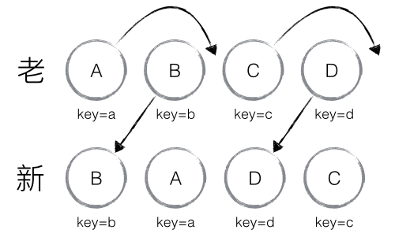
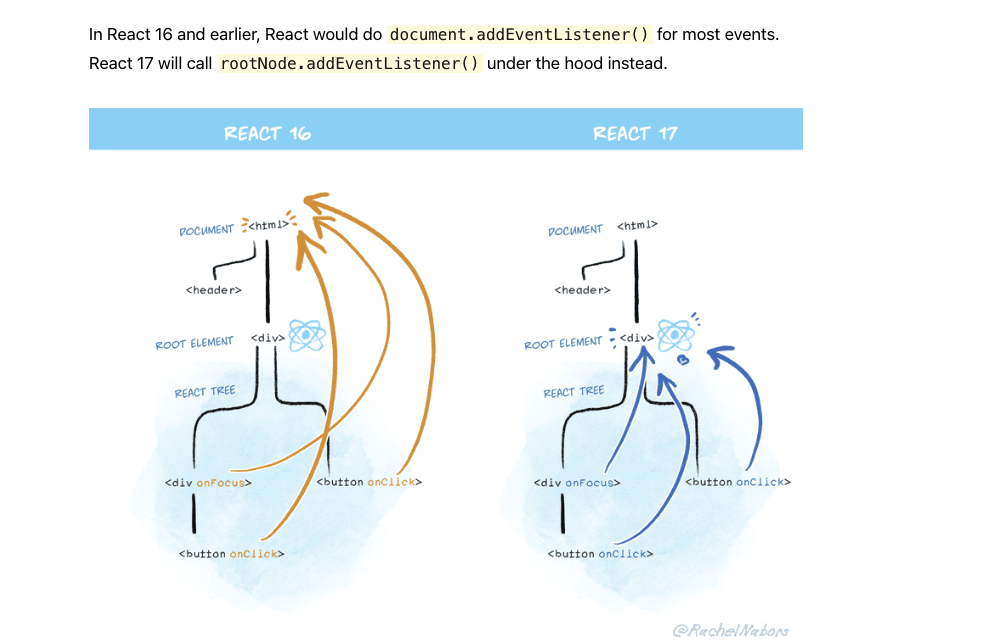

## useEffect 依赖为空数组与 componentDidMount 区别
在 render 执行之后，componentDidMount 会执行，如果在这个生命周期中再一次 setState ，会导致再次 render ，返回了新的值，浏览器只会渲染第二次 render 返回的值，这样可以避免闪屏。
但是 useEffect 是在真实的 DOM 渲染之后才会去执行，这会造成两次 render ，有可能会闪屏。
实际上 useLayoutEffect 会更接近 componentDidMount 的表现，它们都同步执行且会阻碍真实的 DOM 渲染的。

## React Fiber

在 React15 及以前，Reconciler 采用递归的方式创建虚拟 DOM，递归过程是不能中断的。如果组件树的层级很深，递归会占用线程很多时间，造成卡顿。
为了解决这个问题，React16 将递归的无法中断的更新重构为异步的可中断更新，由于曾经用于递归的虚拟 DOM 数据结构已经无法满足需要。于是，全新的 Fiber 架构应运而生。

Fiber 包含三层含义：

- 作为架构来说，之前 React15 的 Reconciler 采用递归的方式执行，数据保存在递归调用栈中，所以被称为 stack Reconciler。React16 的 Reconciler 基于 Fiber 节点实现，被称为 Fiber Reconciler。
- 作为静态的数据结构来说，每个 Fiber 节点对应一个 React element，保存了该组件的类型（函数组件/类组件/原生组件...）、对应的 DOM 节点等信息。
- 作为动态的工作单元来说，每个 Fiber 节点保存了本次更新中该组件改变的状态、要执行的工作（需要被删除/被插入页面中/被更新...）。

## React diff 算法

[The Diffing Algorithm](https://reactjs.org/docs/reconciliation.html#the-diffing-algorithm)

### 1、Elements Of Different Types

如下，div 变成 span，Counter 也会销毁重建：

```js
<div>
  <Counter />
</div>

<span>
  <Counter />
</span>
```
### 2、DOM Elements Of The Same Type

修改 className 或者 style，只会重新渲染。

### 3、Component Elements Of The Same Type

同一个，只会 rerender

[React 源码剖析系列 － 不可思议的 react diff](https://zhuanlan.zhihu.com/p/20346379)

### 1、tree diff

当出现节点跨层级移动时，并不会出现想象中的移动操作，而是以 A 为根节点的树被整个重新创建，这是一种影响 React 性能的操作，因此 React 官方建议不要进行 DOM 节点跨层级的操作。

所以在开发组件时，保持稳定的 DOM 结构会有助于性能的提升。例如，可以通过 CSS 隐藏或显示节点，而不是真的移除或添加 DOM 节点。

### 2、component diff

如果是同一类型的组件，按照原策略继续比较 virtual DOM tree。

如果不是，则将该组件判断为 dirty component，从而替换整个组件下的所有子节点。

对于同一类型的组件，有可能其 Virtual DOM 没有任何变化，如果能够确切的知道这点那可以节省大量的 diff 运算时间，因此 React 允许用户通过 shouldComponentUpdate() 来判断该组件是否需要进行 diff。

### 3、element diff

当节点处于同一层级时，React diff 提供了三种节点操作，分别为：INSERT_MARKUP（插入）、MOVE_EXISTING（移动）和 REMOVE_NODE（删除）。

例如，老集合中包含节点：A、B、C、D，更新后的新集合中包含节点：B、A、D、C，此时新老集合进行 diff 差异化对比，发现 B != A，则创建并插入 B 至新集合，删除老集合 A；以此类推，创建并插入 A、D 和 C，删除 B、C 和 D。

针对这一繁琐冗余的现象，React 提出优化策略：允许开发者对同一层级的同组子节点，添加唯一 key 进行区分，虽然只是小小的改动，性能上却发生了翻天覆地的变化。

（1）新老集合中存在相同节点但位置不同时，对节点进行位置移动的情况



> B、D 往前移，不需要移动，A、C 往后移，需要移动

B：新集合中 B._mountIndex = 0，更新 `lastIndex = Math.max(prevChild._mountIndex, lastIndex)`，prevChild._mountIndex 表示 B 在老集合中的位置即 1，所以 lastIndex = 1。

A：A 在老集合中的位置 A._mountIndex = 0，满足 `child._mountIndex（0）< lastIndex（1）` 的条件，需对 A 进行移动操作 `enqueueMove(this, child._mountIndex, toIndex)`， toIndex 是 A 需要移动到的位置（nextIndex）为 1。更新 lastIndex = Math.max(prevChild._mountIndex, lastIndex) ＝ 1。

D：同 B，不满足 child._mountIndex（3）< lastIndex（1）的条件，因此不对 D 进行移动操作。更新 lastIndex ＝ 3（因为 D 在老集合中的位置 D._mountIndex = 3）。

C：同 A，满足 child._mountIndex（2） < lastIndex（3）的条件，移动操作，更新 lastIndex ＝ 3。

（2）新集合中有新加入的节点且老集合存在需要删除的节点


## 渲染方式

### 流式渲染


## React 17 改变了什么
[React 17](https://reactjs.org/blog/2020/10/20/react-v17.html)

### 1、事件机制

```js
const rootNode = document.getElementById('root');
ReactDOM.render(<App />, rootNode);
```

React 16 及之前, React 会通过 document.addEventListener() 挂载事件。

JSX 上写的事件并没有绑定在对应的真实 DOM 上，而是通过事件代理的方式，将所有的事件都统一绑定在了 document 上。这样的方式不仅减少了内存消耗，还能在组件挂载销毁时统一订阅和移除事件。

另外冒泡到 document 上的事件也不是原生浏览器事件，而是 React 自己实现的合成事件（SyntheticEvent），因此我们如果不想要事件冒泡的话，调用 event.stopPropagation 是无效的，而应该调用 event.preventDefault。

实现合成事件的目的如下：

- 合成事件首先抹平了浏览器之间的兼容问题，另外这是一个跨浏览器原生事件包装器，赋予了跨浏览器开发的能力；
- 对于原生浏览器事件来说，浏览器会给监听器创建一个事件对象。如果你有很多的事件监听，那么就需要分配很多的事件对象，造成高额的内存分配问题。但是对于合成事件来说，有一个事件池专门来管理它们的创建和销毁，当事件需要被使用时，就会从池子中复用对象，事件回调结束后，就会销毁事件对象上的属性，从而便于下次复用事件对象。

而 React 17 会通过 rootNode.addEventListener() 挂载。



> 背后原因是：为了实现渐进式升级，React 需要支持一个项目（一个页面）中存在多个 React 版本，但绑定在 document 无法实现阻止冒泡（因为 document 只有一个）。所以考虑将事件挂在 `const rootNode = document.getElementById('root'); ReactDOM.render(<App />, rootNode)` 指定的 rootNode 中，才能实现多版本的诉求 —— `React 17 is a “stepping stone” release that makes next gradual upgrades feasible`，甚至让「整个页面用 Jquery，内部局部用 React」成为可能。

相应地修复了一些 issue：

（1）如果你设置了 `document.addEventListener(...)`，在 React <= v16 中即便事件处理函数调用了 `e.stopPropagation()`，document 的 listeners 仍然会执行因为 native event 已经在 document 层级了。而 React v17 开始， `e.stopPropagation()` 可以如愿阻止冒泡，所以 document handlers 不再触发：

```js
document.addEventListener('click', function() {
  // This custom handler will no longer receive clicks
  // from React components that called e.stopPropagation()
});
```
如果仍然想收到，可以增加捕获参数 `capture: true`：
```js
document.addEventListener('click', function() {
  // Now this event handler uses the capture phase,
  // so it receives *all* click events below!
}, { capture: true });
```

（2）去掉 “Event Pooling” 的优化，在 React <= v16 中以下代码会造成崩溃（要用必须先调用 `e.persist()`），v17 之后可以自由读取 e 这个变量。

```js
function handleChange(e) {
  setData(data => ({
    ...data,
    // This crashes in React 16 and earlier:
    text: e.target.value
  }));
}
```

### 2、新的 JSX transform

这段 jsx：
```jsx
import React from 'react';
function App() {
  return <h1>Hello World</h1>;
}
```
之前会转化为：
```js
import React from 'react';
function App() {
  return React.createElement('h1', null, 'Hello world');
}
```
而新的 JSX transform 会转为：
```js
// Inserted by a compiler (don't import it yourself!)
import {jsx as _jsx} from 'react/jsx-runtime';
function App() {
  return _jsx('h1', { children: 'Hello world' });
}
```

### 3、其他变化

（1）Effect 清理从同步（阻塞）改成异步（在屏幕更新之后），如果仍需要同步，请用 useLayoutEffect。

Effect 执行通常不依赖屏幕更新，所以本就是在屏幕更新之后异步执行（如果需要同步比如计算位置展示 Tooltip 等则使用 useLayoutEffect）。

但之前 unmount 则是同步的（和 class 组件的 componentWillUnmount 一样），在有动效的较大页面等情况下，性能不好，所以改成了异步。

另外 React 会在运行新的 Effect 之前完成所有组件的 cleanup，React 16 则只保障一个组件若干 effect 的 cleanup 顺序。

```js
useEffect(() => {
  // This is the effect itself.
  return () => {
    // This is its cleanup.
  };
});
```

（2）之前用 forwardRef 或 memo 包裹的组件忘了写 return 的情况不会报错，React 17 开始则会。如果有意不渲染，则需要返回 null：

```js
let Button = forwardRef(() => {
  // We forgot to write return, so this component returns undefined.
  // React 17 surfaces this as an error instead of ignoring it.
  <button />;
});

let Button = memo(() => {
  // We forgot to write return, so this component returns undefined.
  // React 17 surfaces this as an error instead of ignoring it.
  <button />;
});
```

（3）React 17 开始，生产环境中可以有完整的错误堆栈，且 component stacks are now clickable，方便定位问题。

实现原理是，当 React 捕获错误时，将从上面的每个组件内部抛出（并捕获）一个临时错误来重建其组件堆栈， 这会为崩溃增加一点性能损失，但每个组件类型只会发生一次。

## React 18 改变了什么
[React 18](https://reactjs.org/blog/2022/03/29/react-v18.html)

### Concurrent Mode

此前 React 是同步渲染的方式，是在一个单一的、不间断的、同步的事务中，一旦更新开始渲染，在用户可以在屏幕上看到结果之前，没有任何东西可以中断它。

而升级 React 18 并添加并发特性后，渲染方式是可中断的，

### Automatic Batching
```js
// Before: only React events were batched.
setTimeout(() => {
  setCount(c => c + 1);
  setFlag(f => !f);
  // React will render twice, once for each state update (no batching)
}, 1000);

// After: updates inside of timeouts, promises,
// native event handlers or any other event are batched.
setTimeout(() => {
  setCount(c => c + 1);
  setFlag(f => !f);
  // React will only re-render once at the end (that's batching!)
}, 1000);
```

### Transitions

以查询（输入框 + 结果列表）为例，输入框是 urgent，结果列表不是 urgent 而且希望展示最终一次的查询结果，就可以将结果部分用 startTransition 包裹：

```js
import {startTransition} from 'react';

// Urgent: Show what was typed
setInputValue(input);

// Mark any state updates inside as transitions
startTransition(() => {
  // Transition: Show the results
  setSearchQuery(input);
});
```
useTransition 和 startTransition：
```jsx
function App() {
  const [isPending, startTransition] = useTransition();
  const [count, setCount] = useState(0);
  
  function handleClick() {
    startTransition(() => {
      setCount(c => c + 1);
    })
  }

  return (
    <div>
      {isPending && <Spinner />}
      <button onClick={handleClick}>{count}</button>
    </div>
  );
}
```

### Suspense

[suspense in React 18](https://github.com/reactjs/rfcs/blob/main/text/0213-suspense-in-react-18.md)

```jsx
// This component is loaded dynamically
const OtherComponent = React.lazy(() => import('./OtherComponent'));

function MyComponent() {
  return (
    // Displays <Spinner> until OtherComponent loads
    <React.Suspense fallback={<Spinner />}>
      <div>
        <OtherComponent />
      </div>
    </React.Suspense>
  );
}
```

### 优化建议 —— You Might Not Need an Effect

（1）You don’t need Effects to transform data for rendering：衍生状态直接在 render 函数中计算即可。

（2）Resetting all state when a prop changes：重置所有状态可以用 key，而非在 useEffect 里根据 props 去重置 state。

（3）Adjusting some state when a prop changes：重置部分状态，也可以在 render 阶段进行：

```js
function List({ items }) {
  const [isReverse, setIsReverse] = useState(false);
  const [selection, setSelection] = useState(null);

  // Better: Adjust the state while rendering
  const [prevItems, setPrevItems] = useState(items);
  if (items !== prevItems) {
    setPrevItems(items);
    setSelection(null);
  }
  // ...
}
```

（4）You don’t need Effects to handle user events / Sharing logic between event handlers：在多个事件回调里共享逻辑，可以抽出公共函数复用。
```js
function ProductPage({ product, addToCart }) {
  // ✅ Good: Event-specific logic is called from event handlers
  function buyProduct() {
    addToCart(product);
    showToast(`Added ${product.name} to the shopping cart!`);    
  }

  function handleBuyClick() {
    buyProduct();
  }

  function handleCheckoutClick() {
    buyProduct();
    navigateTo('/checkout');
  }
  // ...
}
```

（5）Initializing the application

之前的做法，useEffect 里做初始化的事情，但 Strict Mode 会在开发阶段执行两次可能会出问题：

```js
function App() {
  // 🔴 Avoid: Effects with logic that should only ever run once
  useEffect(() => {
    loadDataFromLocalStorage();
    checkAuthToken();
  }, []);
  // ...
}
```

建议：
```js
let didInit = false;

function App() {
  useEffect(() => {
    if (!didInit) {
      didInit = true;
      // ✅ Only runs once per app load
      loadDataFromLocalStorage();
      checkAuthToken();
    }
  }, []);
  // ...
}
```

也可以：（但 SSR 项目谨慎使用全局变量）
```js
if (typeof window !== 'undefined') { // Check if we're running in the browser.
   // ✅ Only runs once per app load
  checkAuthToken();
  loadDataFromLocalStorage();
}

function App() {
  // ...
}
```

（6）Notifying parent components about state changes

这样执行会太晚：

```js
function Toggle({ onChange }) {
  const [isOn, setIsOn] = useState(false);

  // 🔴 Avoid: The onChange handler runs too late
  useEffect(() => {
    onChange(isOn);
  }, [isOn, onChange])

  function handleClick() {
    setIsOn(!isOn);
  }

  function handleDragEnd(e) {
    if (isCloserToRightEdge(e)) {
      setIsOn(true);
    } else {
      setIsOn(false);
    }
  }

  // ...
}
```

删除 Effect 并在同一个事件处理程序中更新两个组件的状态：

```js
function Toggle({ onChange }) {
  const [isOn, setIsOn] = useState(false);  // 如果 the component is fully controlled by its parent，state 也可以不要

  function updateToggle(nextIsOn) {
    // ✅ Good: Perform all updates during the event that caused them
    setIsOn(nextIsOn);
    onChange(nextIsOn);
  }

  function handleClick() {
    updateToggle(!isOn);
  }

  function handleDragEnd(e) {
    if (isCloserToRightEdge(e)) {
      updateToggle(true);
    } else {
      updateToggle(false);
    }
  }

  // ...
}
```

state 和 props 同步问题，也可以通过“提升状态”让父组件通过切换父组件自己的状态来完全控制 Toggle。

每当您尝试使两个不同的状态变量保持同步时，这都是尝试提升状态的信号。

（7）Passing data to the parent

不建议：

```js
function Parent() {
  const [data, setData] = useState(null);
  // ...
  return <Child onFetched={setData} />;
}

function Child({ onFetched }) {
  const data = useSomeAPI();
  // 🔴 Avoid: Passing data to the parent in an Effect
  useEffect(() => {
    if (data) {
      onFetched(data);
    }
  }, [onFetched, data]);
  // ...
}
```

建议：提升到上层组件，这更简单并保持数据流可预测 —— 数据从父级向下流向子级。

```js
function Parent() {
  const data = useSomeAPI();
  // ...
  // ✅ Good: Passing data down to the child
  return <Child data={data} />;
}

function Child({ data }) {
  // ...
}
```

（8）Subscribing to an external store

```js
function useOnlineStatus() {
  // Not ideal: Manual store subscription in an Effect
  const [isOnline, setIsOnline] = useState(true);
  useEffect(() => {
    function updateState() {
      setIsOnline(navigator.onLine);
    }

    updateState();

    window.addEventListener('online', updateState);
    window.addEventListener('offline', updateState);
    return () => {
      window.removeEventListener('online', updateState);
      window.removeEventListener('offline', updateState);
    };
  }, []);
  return isOnline;
}

function ChatIndicator() {
  const isOnline = useOnlineStatus();
  // ...
}
```

建议：改用 [useSyncExternalStore](https://beta.reactjs.org/apis/usesyncexternalstore) 实现

```js
function subscribe(callback) {
  window.addEventListener('online', callback);
  window.addEventListener('offline', callback);
  return () => {
    window.removeEventListener('online', callback);
    window.removeEventListener('offline', callback);
  };
}

function useOnlineStatus() {
  // ✅ Good: Subscribing to an external store with a built-in Hook
  return useSyncExternalStore(
    subscribe, // React won't resubscribe for as long as you pass the same function
    () => navigator.onLine, // How to get the value on the client
    () => true // How to get the value on the server
  );
}

function ChatIndicator() {
  const isOnline = useOnlineStatus();
  // ...
}
```

（9）Fetching data

根据多种状态获取接口，不必在事件回调里：

```js
function SearchResults({ query }) {
  const [results, setResults] = useState([]);
  const [page, setPage] = useState(1);

  useEffect(() => {
    // 🔴 Avoid: Fetching without cleanup logic
    fetchResults(query, page).then(json => {
      setResults(json);
    });
  }, [query, page]);

  function handleNextPageClick() {
    setPage(page + 1);
  }
  // ...
}
```

但这种写法存在竞态问题，您可以使用 Effects 获取数据，但您需要实现清理以避免竞争条件。通过设置一个锁，来确保是每次结果都是来自最新的请求。

```js
function SearchResults({ query }) {
  const [results, setResults] = useState([]);
  const [page, setPage] = useState(1); 
  useEffect(() => {
    let ignore = false;
    fetchResults(query, page).then(json => {
      if (!ignore) {
        setResults(json);
      }
    });
    return () => {
      ignore = true;
    };
  }, [query, page]);

  function handleNextPageClick() {
    setPage(page + 1);
  }
  // ...
}
```

也可以写一个自定义 hook：

```js
function SearchResults({ query }) {
  const [page, setPage] = useState(1); 
  const params = new URLSearchParams({ query, page });
  const results = useData(`/api/search?${params}`);

  function handleNextPageClick() {
    setPage(page + 1);
  }
  // ...
}

function useData(url) {
  const [result, setResult] = useState(null);
  useEffect(() => {
    let ignore = false;
    fetch(url)
      .then(response => response.json())
      .then(json => {
        if (!ignore) {
          setResult(json);
        }
      });
    return () => {
      ignore = true;
    };
  }, [url]);
  return result;
}
```