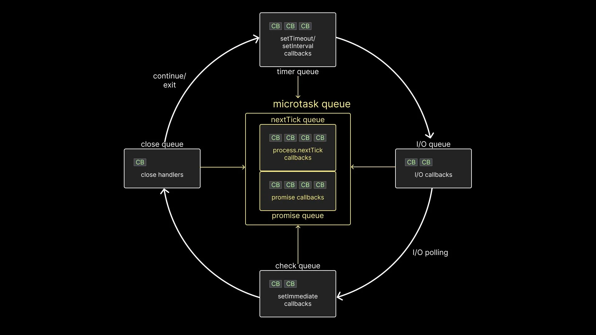

[A Complete Visual Guide to Understanding the Node.js Event Loop](https://www.builder.io/blog/visual-guide-to-nodejs-event-loop)


### 一、几类回调的队列：


- timer queue (technically a min-heap): holds callbacks associated with setTimeout and setInterval.
- I/O queue: contains callbacks associated with all the async methods such as methods associated with the fs and http modules.
- check queue: holds callbacks associated with the setImmediate function, which is specific to Node.
- close queue: holds callbacks associated with the close event of an async task.

### 二、在事件循环中，执行顺序遵循某些规则:

- 1、Any callbacks in the microtask queue are executed. First, tasks in the nextTick queue and only then tasks in the promise queue.
- 2、All callbacks within the timer queue are executed.
- 3、Callbacks in the microtask queue (if present) are executed after every callback in the timer queue. First, tasks in the nextTick queue, and then tasks in the promise queue.
- 4、All callbacks within the I/O queue are executed.
- 5、Callbacks in the microtask queues (if present) are executed, starting with nextTickQueue and then Promise queue.
- 6、All callbacks in the check queue are executed.
- 7、Callbacks in the microtask queues (if present) are executed after every callback in the check queue. First, tasks in the nextTick queue, and then tasks in the promise queue.
- 8、All callbacks in the close queue are executed.
- 9、For one final time in the same loop, the microtask queues are executed. First, tasks in the nextTick queue, and then tasks in the promise queue.

即顺序为：微任务 cb、timer cb、微任务cb、i/o cb、微任务cb、check 队列 cb、微任务 cb、close队列cb、微任务cb。

### 三、几个问答：

1、When an async task completes in libuv, at what point does Node decide to run the associated callback function on the call stack?

Answer:

Callback functions are executed only when the call stack is empty.

当一个异步任务在 libuv 中完成时，Node在什么时候决定在调用堆栈上运行相关的回调函数? 

答: 只有当调用堆栈为空时才执行回调函数。

2、Does Node wait for the call stack to be empty before running the callback function, or does it interrupt the normal flow of execution to run the callback function?

Answer:

The normal flow of execution will not be interrupted to run a callback function.

Node 在运行回调函数之前是否等待调用堆栈为空，或者它是否中断正常的执行流以运行回调函数? 

答: 正常的执行流不会因为运行回调函数而中断。

3、What about other async methods like setTimeout and setInterval, which also delay the execution of a callback function?

Answer:

setTimeout and setInterval callbacks are given first priority.

还有其他异步方法，比如 setTimeout 和 setInterval，它们也会延迟回调函数的执行。

答: setTimeout 和 setInterval 回调函数被赋予优先级。

4、If two async tasks such as setTimeout and readFile complete at the same time, how does Node decide which callback function to run first on the call stack? Does one get priority over the other?

Answer:

Timer callbacks are executed before I/O callbacks, even if both are ready at the exact same time.

如果两个异步任务(如 setTimeout 和 readFile)同时完成，Node 如何决定哪个回调函数首先在调用堆栈上运行? 一个比另一个有优先权吗? 

答: 定时器回调在 I/O 回调之前执行，即使两者同时就绪。

### 四、验证 Demo：

1、微队列先执行 nextTick 然后是 promise：

```js
process.nextTick(() => console.log('this is process.nextTick 1'))
process.nextTick(() => {
  console.log('this is process.nextTick 2')
  process.nextTick(() =>
    console.log('this is the inner next tick inside next tick')
  )
})
process.nextTick(() => console.log('this is process.nextTick 3'))

Promise.resolve().then(() => console.log('this is Promise.resolve 1'))
Promise.resolve().then(() => {
  console.log('this is Promise.resolve 2')
  process.nextTick(() =>
    console.log('this is the inner next tick inside Promise then block')
  )
})
Promise.resolve().then(() => console.log('this is Promise.resolve 3'))
```

结果为：

```js
this is process.nextTick 1
this is process.nextTick 2
this is process.nextTick 3
this is the inner next tick inside next tick
this is Promise.resolve 1
this is Promise.resolve 2
this is Promise.resolve 3
this is the inner next tick inside Promise then block
```

验证了 “Callbacks in the microtask queues (if present) are executed, starting with nextTick Queue and then Promise queue.”

也就是微队列中，会先执行 nextTick 队列，直到为空，才会执行 Promise 队列。

2、执行代码

```js
const fs = require('fs')

Promise.resolve().then(() => console.log('this is Promise.resolve'))

setTimeout(() => {
  console.log('this is setTimeOut cb1')
  Promise.resolve().then(() => console.log('this is Promise.resolve 1'))
}, 0);

setTimeout(() => {
  console.log('this is setTimeOut cb2')
  Promise.resolve().then(() => console.log('this is Promise.resolve 2'))
}, 0);

fs.readFile('/Users/baoerjie/Documents/duoduo/note/articles/node/cbs.webp', (err, data) => {
  console.log('this is readFile cb', err, data)
})
```

执行结果为：

```js
this is Promise.resolve
this is setTimeOut cb1
this is Promise.resolve 1
this is setTimeOut cb2
this is Promise.resolve 2
this is readFile cb null
```

验证了执行顺序为 “1 微任务 cb、2 timer cb、3 微任务cb、4 I/O cb”，并且如 “3、Callbacks in the microtask queue (if present) are executed after every callback in the timer queue. First, tasks in the nextTick queue, and then tasks in the promise queue”

就是说 every timer 结束后都会去检查微任务。

3、更完整的例子

```js
setTimeout(() => console.log('this is setTimeout 1'), 0)
setTimeout(() => {
  console.log('this is setTimeout 2')
  Promise.resolve().then(() => console.log('inner this is Promise.resolve 2'))
}, 0)
setTimeout(() => {
  console.log('this is setTimeout 3')
  Promise.resolve().then(() => console.log('inner this is Promise.resolve 3'))
}, 0)

Promise.resolve().then(() => console.log('this is Promise.resolve 1'))
Promise.resolve().then(() => {
  console.log('this is Promise.resolve 2')
})
Promise.resolve().then(() => console.log('this is Promise.resolve 3'))
```

执行结果为：

```js
this is Promise.resolve 1
this is Promise.resolve 2
this is Promise.resolve 3
this is setTimeout 1
this is setTimeout 2
inner this is Promise.resolve 2
this is setTimeout 3
inner this is Promise.resolve 3
```
