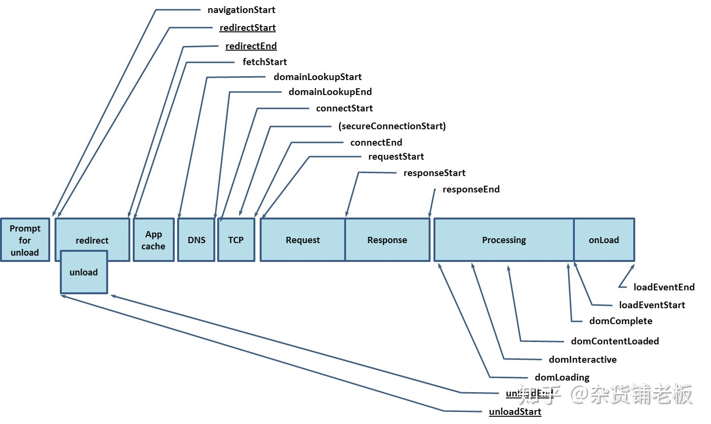

# 性能度量

[Web 指标](https://web.dev/vitals/)

## 核心指标

- Time To Interactive（TTI）：可交互时间
- Largest Contentful Paint (LCP) ：最大内容绘制，测量加载性能。为了提供良好的用户体验，LCP 应在页面首次开始加载后的2.5 秒内发生。
- First Input Delay (FID) ：首次输入延迟，测量交互性。为了提供良好的用户体验，页面的 FID 应为100 毫秒或更短。
- Cumulative Layout Shift (CLS) ：累积布局偏移，测量视觉稳定性。为了提供良好的用户体验，页面的 CLS 应保持在 0.1 或更少。



## 如何度量

[PerformanceObserver 的 supportedEntryTypes](https://developer.mozilla.org/en-US/docs/Web/API/PerformanceObserver/supportedEntryTypes)

PerformanceObserver.supportedEntryTypes

// returns ["element", "event", "first-input", "largest-contentful-paint", "layout-shift", "longtask", "mark", "measure", "navigation", "paint", "resource"] in Chrome 89

上述核心指标里可以监听到 largest-contentful-paint、first-input、layout-shift，这三个都可以参考 [web-vitals](https://github.com/GoogleChrome/web-vitals) 如何度量

（1）度量 TTI


（2）度量 LCP

[onLCP](https://github.dev/GoogleChrome/web-vitals/blob/main/src/onLCP.ts)

`lcp = largest-contentful-paint 监听到的最后一个值 - performance 中 navigation 的 activationStart`

navigation activationStart 表示路由激活，而非导航开始，因为存在 prerender 的情况，导航已经开始，但路由还未激活。

```js
new PerformanceObserver((entryList) => {
    const entries = entryList.getEntries()
    const lastEntry = entries[entries.length - 1] as LargestContentfulPaint;
    if (lastEntry) {
        // The startTime attribute returns the value of the renderTime if it is
        // not 0, and the value of the loadTime otherwise.
        // The activationStart reference is used because LCP should be relative to page
        // activation rather than navigation start if the page was prerendered. But in cases
        // where `activationStart` occurs after the LCP, this time should be
        // clamped at 0.
        const activationStart = window.performance &&
            performance.getEntriesByType &&
            performance.getEntriesByType('navigation')[0]?.activationStart

        const value = Math.max(lastEntry.startTime - activationStart, 0);

        // Only report if the page wasn't hidden prior to LCP.
        if (value < visibilityWatcher.firstHiddenTime) {
            metric.value = value;
            metric.entries = [lastEntry];
            report();
        }
    }
}).observe({type: 'largest-contentful-paint', buffered: true});
```

（3）度量 FID

FID 测量从用户第一次与页面交互（例如当他们单击链接、点按按钮或使用由 JavaScript 驱动的自定义控件）直到浏览器对交互作出响应，并实际能够开始处理事件处理程序所经过的时间。

[onFID](https://github.dev/GoogleChrome/web-vitals/blob/main/src/onFID.ts)

`FID `

```js
new PerformanceObserver((entryList) => {
    const entries = entryList.getEntries()
    let sessionEntries: PerformanceEntry[] = [];
    const visibilityWatcher = getVisibilityWatcher();
    let metric = initMetric('FID');
    let report: ReturnType<typeof bindReporter>;

    entries.forEach((entry) => {
      // Only report if the page wasn't hidden prior to the first input.
      if (entry.startTime < visibilityWatcher.firstHiddenTime) {
        metric.value = entry.processingStart - entry.startTime;
        metric.entries.push(entry);
        report(true);
      }
    })
}).observe({type: 'first-input', buffered: true});
```

（4）度量 CLS

[onCLS](https://github.dev/GoogleChrome/web-vitals/blob/main/src/onCLS.ts)

`cls 遍历 layout-shift 监听到的值，获取每个会话窗口偏移量之和（会话窗口为，和第一个不超过 5s 且前后不超过 1s）`

[不断改进 CLS 指标](https://web.dev/evolving-cls/)

```js
new PerformanceObserver((entryList) => {
    const entries = entryList.getEntries()
    let sessionEntries: PerformanceEntry[] = [];
    entries.forEach((entry) => {
        // Only count layout shifts without recent user input.
        if (!entry.hadRecentInput) {
            const firstSessionEntry = sessionEntries[0];
            const lastSessionEntry = sessionEntries[sessionEntries.length - 1];

            // If the entry occurred less than 1 second after the previous entry
            // and less than 5 seconds after the first entry in the session,
            // include the entry in the current session. Otherwise, start a new
            // session.
            if (
                sessionValue &&
                entry.startTime - lastSessionEntry.startTime < 1000 &&
                entry.startTime - firstSessionEntry.startTime < 5000
            ) {
                sessionValue += entry.value;
                sessionEntries.push(entry);
            } else {
                sessionValue = entry.value;
                sessionEntries = [entry];
            }
        }
    });

    // If the current session value is larger than the current CLS value,
    // update CLS and the entries contributing to it.
    if (sessionValue > metric.value) {
        metric.value = sessionValue;
        metric.entries = sessionEntries;
        report();
    }
}).observe({type: 'layout-shift', buffered: true});
```
