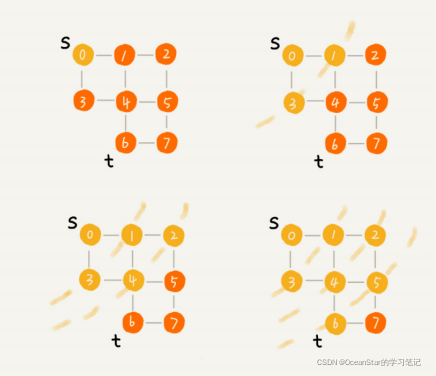

## 深度、广度优先遍历

图的遍历是指，从给定图中任意指定的顶点（称为初始点）出发，按照某种搜索方法沿着图的边访问图中的所有顶点，使每个顶点仅被访问一次，这个过程称为图的遍历。

图的遍历过程中，根据搜索方法的不同，又可以划分为两种搜索策略：

- 深度优先搜索（DFS，Depth First Search）
- 广度优先搜索（BFS，Breadth First Search）

实现深度优先遍历的关键在于回溯，实现广度优先遍历的关键在于回放。

### 深度优先搜索

深度优先搜索（Depth-First-Search），简称 DFS。

为以下3个步骤：

- 首先选定一个未被访问过的顶点V作为起始顶点（或者访问指定的起始顶点V），并将其标记为已访问

- 然后搜索与顶点V邻接的所有顶点，判断这些顶点是否被访问过，如果有未被访问过的顶点W；再选取与顶点W邻接的未被访问过的一个顶点并进行访问，依次重复进行。当一个顶点的所有的邻接顶点都被访问过时，则依次回退到最近被访问的顶点。若该顶点还有其他邻接顶点未被访问，则从这些未被访问的顶点中取出一个并重复上述过程，直到与起始顶点V相邻接的所有顶点都被访问过为止。

- 若此时图中依然有顶点未被访问，则再选取其中一个顶点作为起始顶点并进行遍历，转（2）。反之，则遍历结束。

深度优先搜索是递归过程，带有回退操作，因此需要使用栈存储访问的路径信息。当访问到的当前顶点没有可以前进的邻接顶点时，需要进行出栈操作，将当前位置回退至出栈元素位置。

### 广度优先搜索

为以下3个步骤：

- 从图中某顶点v出发，在访问了v之后依次访问v的各个未曾访问过的邻接点

- 然后分别从这些邻接点出发依次访问它们的邻接点，并使得“先被访问的顶点的邻接点先于后被访问的顶点的邻接点被访问，直至图中所有已被访问的顶点的邻接点都被访问到。

- 如果此时图中尚有顶点未被访问，则需要另选一个未曾被访问过的顶点作为新的起始点，重复上述过程，直至图中所有顶点都被访问到为止。

可以看出，广度优先搜索它其实就是一种“地毯式”层层推进的搜索策略，即先查找离起始顶点最近的，然后是次近的，依次往外搜索。

